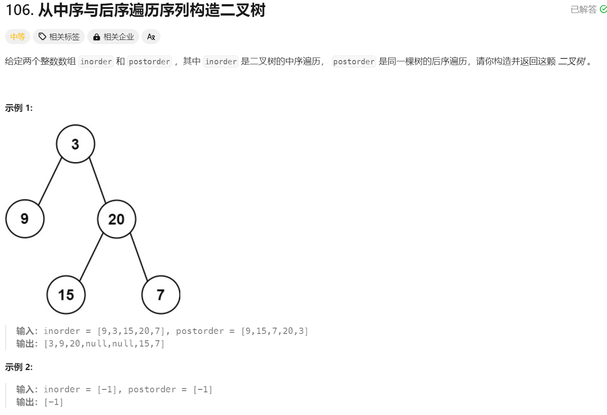
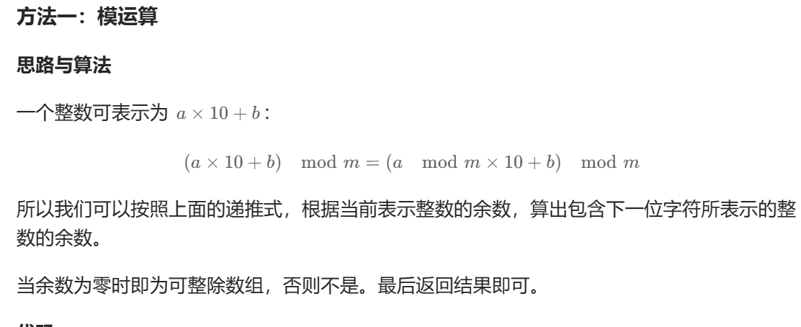
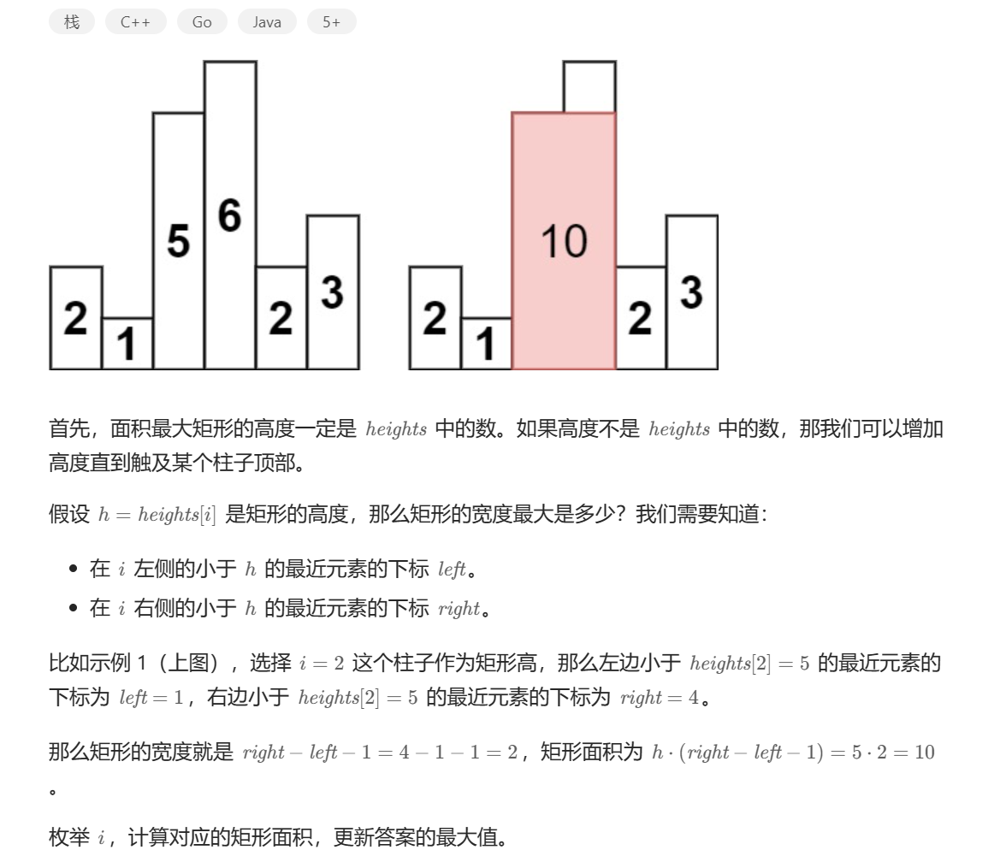
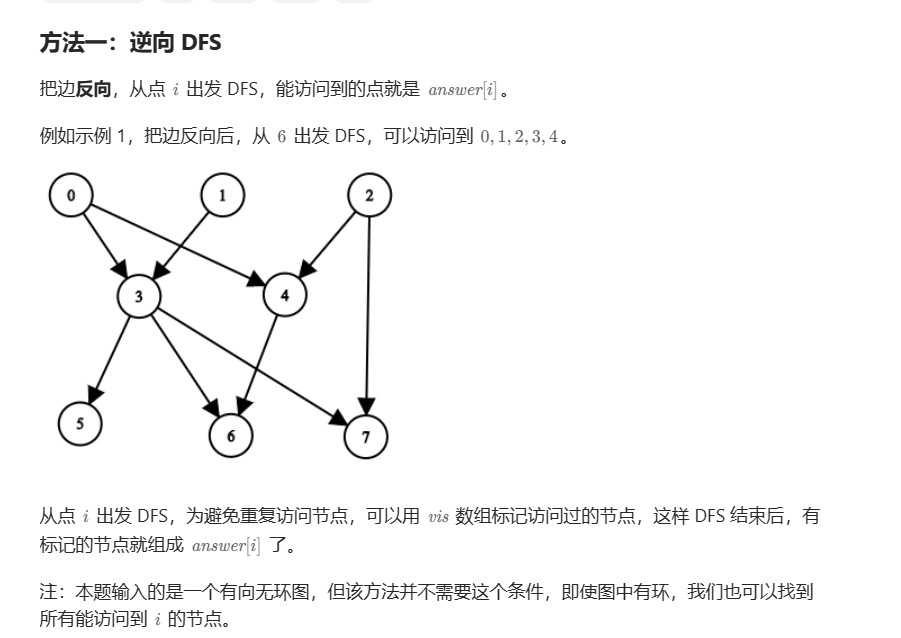
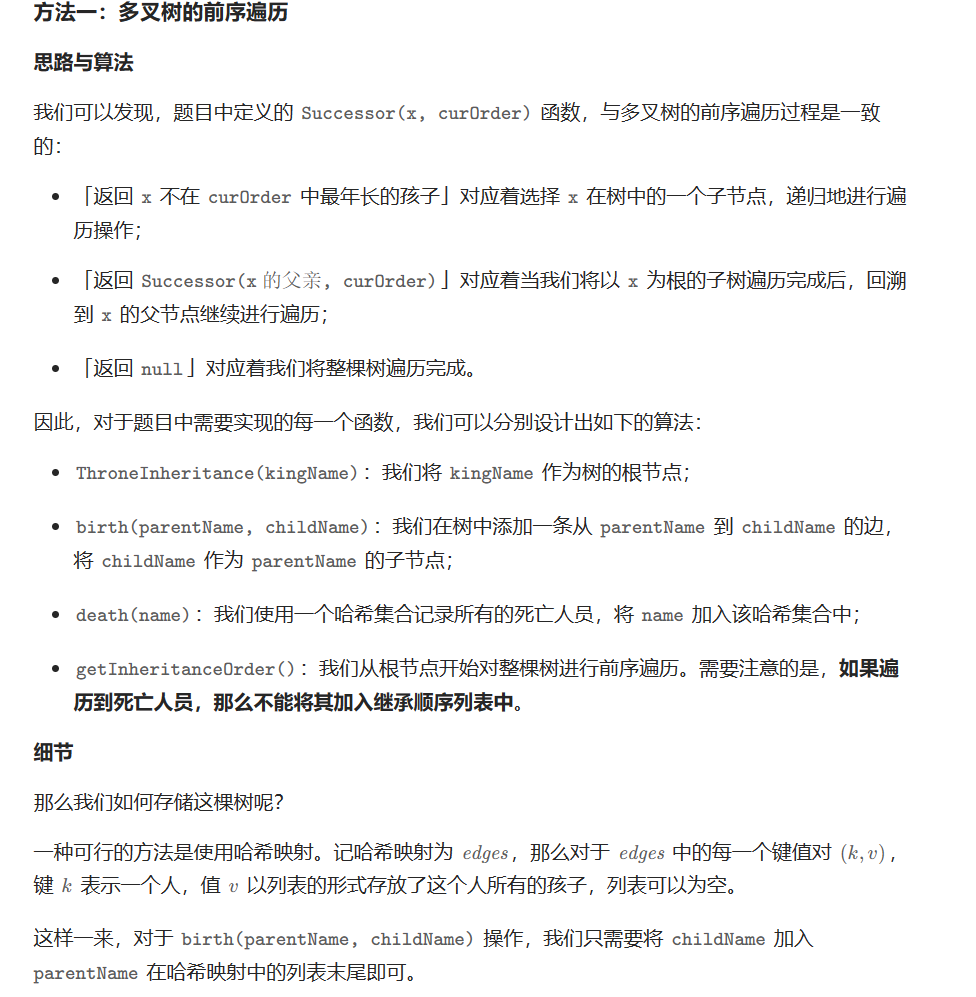
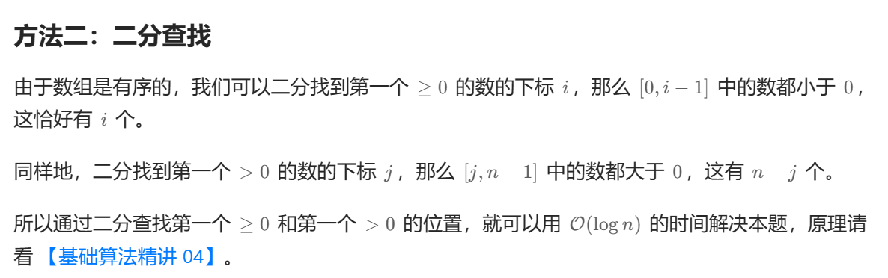
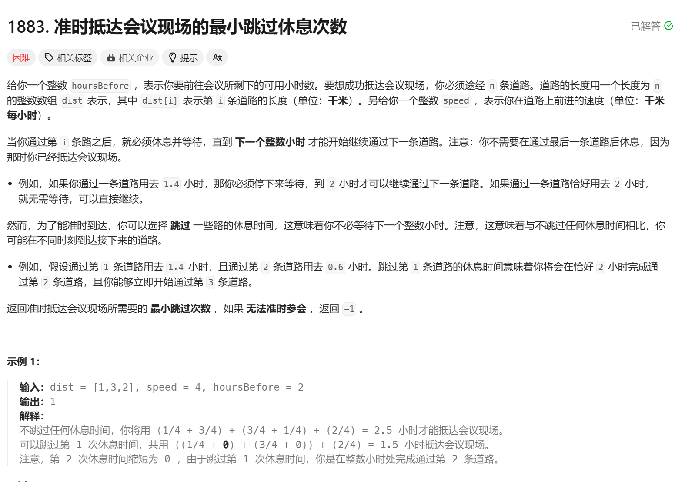
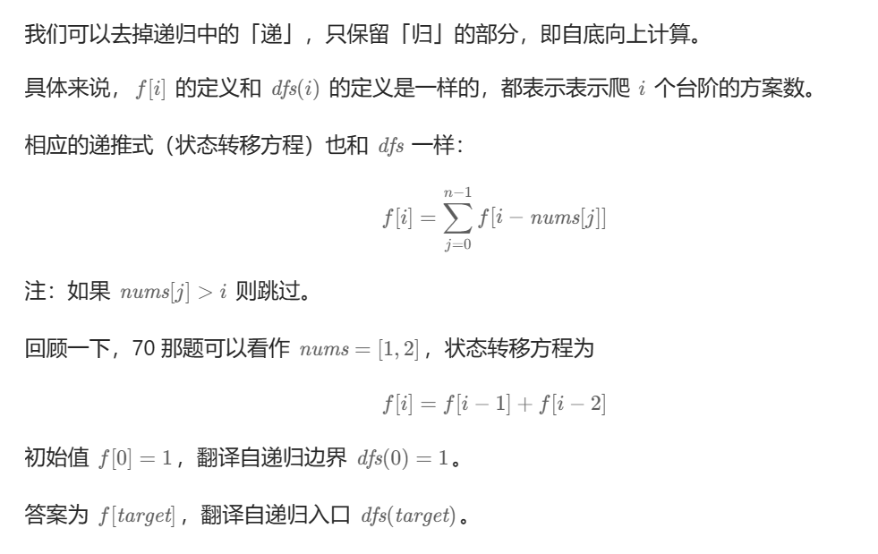
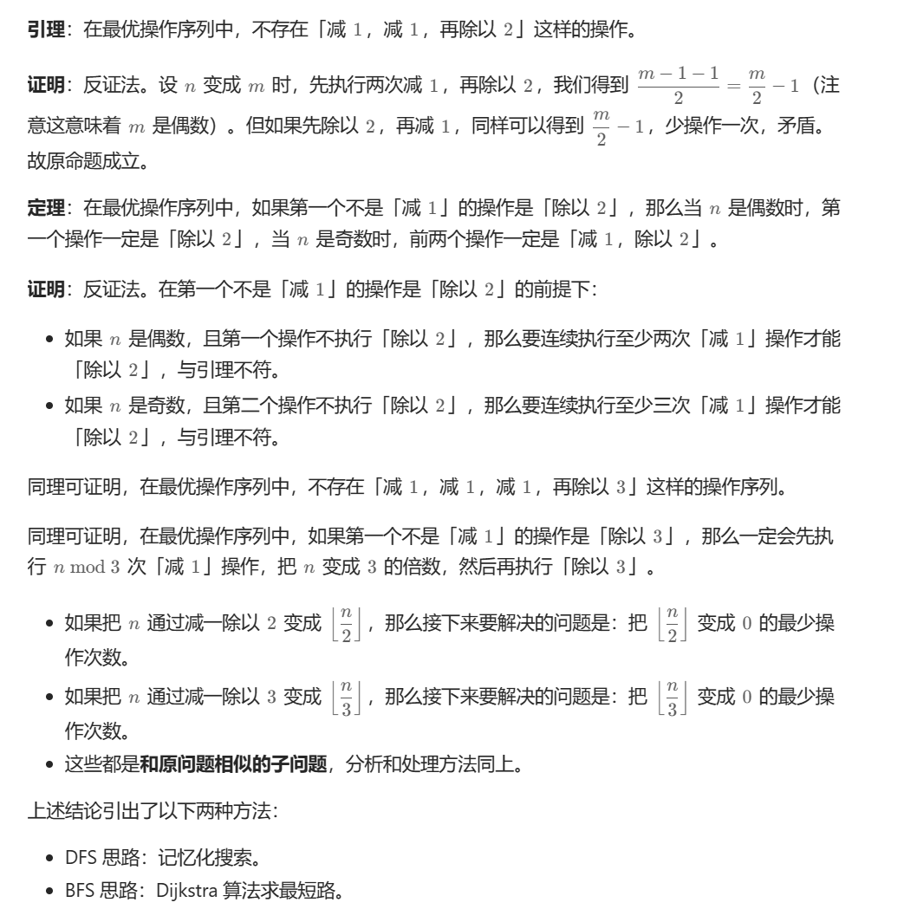

[toc]


## 1. **动态规划 / 二分查找 : 分割数组最大值(hard)**


```cpp
class Solution {
public:
    int splitArray(vector<int>& nums, int m) {
    int n = nums.size();
    vector<vector<long long>> f(n+1,vector<long long>(m+1, 0x3f3f3f3f3f3f3f3f));
    vector<long long> sub(n+1,0);
    for(int i = 0; i < n ; i ++)
        sub[i + 1] = sub[i] + nums[i];
    f[0][0] = 0;

    for(int i = 1; i <= n ; i ++)
        for(int j  = 1; j <= min(i,m); j ++)  //j <=i, && j <= m 
            for(int k = 0; k <= i ;k ++)
                f[i][j] = min(f[i][j],max(f[k][j-1],sub[i] - sub[k]));

    return (int)f[n][m];
     
    }
};
```


```cpp
class Solution {
public:
    bool check(vector<int> &nums,int x,int m){
        long long sum = 0;
        int cnt = 1;
        for(int i  = 0 ; i <nums.size(); i ++){
            if(sum + nums[i] > x){
                cnt ++;
                sum = nums[i];
            }
            else{
                sum += nums[i];
            }
        }
        return cnt <= m;
    }

    int splitArray(vector<int>& nums, int m) {
    long long left = 0, right = 0;
    for(int i = 0; i < nums.size(); i ++){
        right += nums[i];
        if(left < nums[i])
            left = nums[i];
    }
    //left是最大值
    //right是所有元素的和
    int res = -1;
    while(left  <= right){
        long long mid = (left + right) >> 1;
        
        if(check(nums,mid,m)){
            right = mid - 1;
            res = mid;
        }
        else  left = mid + 1;
    }
    return res;
     
    }
};
```

```cpp
int l = *max_element(num.begin(), num.end());
int r = accumulate(nums.begin(), nums.end(), 0);
```


## 2. 贪心算法 : 最大交换


```cpp
class Solution {
public:
    int maximumSwap(int num) {
        string s = to_string(num);
        int idx1 = -1,idx2 = -1, n  = s.size();
        int maxID = n - 1;
        for(int i = n - 1;i >= 0; i --){
            if(s[i] > s[maxID])
                maxID = i;
            else if(s[i] < s[maxID]){
                idx1 = i;
                idx2 = maxID;
            }
            //if s[i] == maxID不操作，因为要选取尽可能靠右的maxID
        }
        if(idx1 >= 0){
            swap(s[idx1],s[idx2]);
            return stoi(s);
        }
        else 
            return stoi(s);
    }
};
```


```cpp
class Solution {
public:
    int maximumSwap(int num) {
        string s = to_string(num), t = s;
        sort(t.rbegin(),t.rend());
        for(int i = 0 ; i < s.size(); i ++){
            if(s[i] != t[i]){ //s是原数组
                swap(s[i],*find(s.rbegin(),s.rend(),t[i]));//从后向前找
                break;
            }
        }
        return stoi(s);
    }
};
```


## 3. 枚举/双单调栈


思路1：枚举

- Try all the possible indices `i` as the peak.
- If `i` is the peak, start from `heights[i] = maxHeights[i]`, and `heights[j] = min(maxHeights[j], heights[j + 1])` for `0 <= j < i `
- If `i` is the peak, start from `heights[i] = maxHeights[i]`, and `heights[j] = max(maxHeights[j], heights[j - 1])` for `i < j < heights.size()`

```cpp
class Solution {
public:
    long long maximumSumOfHeights(vector<int>& maxHeights) {
        long long res = 0;
        int n = maxHeights.size();
        for(int i = 0; i < n ; i ++){
            long long tmp = maxHeights[i];
            int left = maxHeights[i];
            for(int k = i - 1 ; k >= 0; k --){
                left = min(left,maxHeights[k]);
                tmp += left;
            }
            int right = maxHeights[i];
            for(int k = i + 1; k < n; k ++){
                right = min(right,maxHeights[k]);
                tmp += right;
            }
            res = max(res,tmp);
        }
        return res;
    }
    
};
```


```cpp
class Solution {
public:
    long long maximumSumOfHeights(vector<int>& maxHeights) {
        int n = maxHeights.size();
        long long res = 0;
        vector<long long> prefix(n), suffix(n);
        stack<int> stack1, stack2;
     
        for (int i = 0; i < n; i++) {
            while (!stack1.empty() && maxHeights[i] < maxHeights[stack1.top()]) {
                stack1.pop();
            }
            if (stack1.empty()) {
                prefix[i] = (long long)(i + 1) * maxHeights[i];
            } else {
                prefix[i] = prefix[stack1.top()] + (long long)(i - stack1.top()) * maxHeights[i];
            }
            stack1.emplace(i);
        }
        for (int i = n - 1; i >= 0; i--) {
            while (!stack2.empty() && maxHeights[i] < maxHeights[stack2.top()]) {
                stack2.pop();
            }
            if (stack2.empty()) {
                suffix[i] = (long long)(n - i) * maxHeights[i];
            } else {
                suffix[i] = suffix[stack2.top()] + (long long)(stack2.top() - i) * maxHeights[i];
            }
            stack2.emplace(i);
            res = max(res, prefix[i] + suffix[i] - maxHeights[i]);
        }
        return res;
    }
};

```


## 4. 二分查找


```cpp

class Solution {
public:
    int maxNumberOfAlloys(int n, int k, int budget, vector<vector<int>>& composition, vector<int>& stock, vector<int>& cost) {
        int l = 1, r = 2e8,ans = 0;
        while(l <= r){
            int mid = (l + r) / 2;
            bool value = false; //能制造mid个
            
            for(int i = 0;i < k; i ++){
                long long sum = 0;
                for(int j = 0; j < n ; j ++)
                    sum += max(static_cast<long long>(composition[i][j]) * mid - stock[j],0LL) * cost[j];
                if(sum <= budget){
                    value = true;
                    break;
                }
                
            }
            if(value) {ans = mid; l = mid + 1;}
            else r = mid - 1;
        }
        return ans;
    }
};
```

## 5. 最近公共祖先(hard)

### **并查集要``` return p[x] ```而不是``` return x``` !!!!!**

在这个 `find` 函数中，我们使用了路径压缩的技巧。这意味着在查找根节点的过程中，我们不仅返回根节点，还将路径上的每个节点直接连接到根节点。这是通过 `p[x] = find(p, p[x])` 这行代码实现的。

当 `if(x != p[x])` 条件满足，我们递归地进行路径压缩。直到我们找到一个节点，它是自己的父节点，即找到了根节点（`x == p[x]`）。这时，递归开始回溯。

在回溯的过程中，`p[x]` 已经被更新为根节点。所以，`return p[x]` 实际上返回的是根节点，即使此时的 `x` 不是根节点。

如果我们写 `return x`，那么在递归回溯的过程中，我们将返回原始的 `x` 值，而不是更新后的根节点。这将导致路径压缩无效，因为我们没有正确地返回并更新根节点。

所以，我们必须写 `return p[x]`，以确保在递归回溯的过程中，我们总是返回根节点，从而使路径压缩有效。

### function<void(int, int)> tarjan = [&](int node, int parent)(int node, int parent)

这是一个C++中的lambda函数，并且它被赋给了一个名为`tarjan`的`std::function`对象。这个lambda函数接受两个整数参数`node`和`parent`。这个lambda函数使用了`&`捕获说明符，这意味着它可以访问其定义所在的作用域中的所有变量，包括那些在函数中定义的变量。

让我们详细解释一下这个语句的每个部分：

- `std::function<void(int, int)>`：这是一个`std::function`类型的对象。`std::function`是一个通用的可调用对象包装器。在这里，它被声明为接受两个`int`参数并返回`void`的函数。
- `tarjan`：这是我们为`std::function`对象命名的变量名。
- `= [&](int node, int parent)`：这是一个lambda函数的定义。`&`表示此lambda函数将以引用方式捕获其定义所在的作用域中的所有变量。`(int node, int parent)`是函数的参数列表。
- `{...}`：这里应该是lambda函数的主体，但在你给出的代码片段中，它被省略了。这个函数体应该包含执行Tarjan算法的代码。

注意，这个lambda函数是**递归**的，因为它在其函数体中可能会**调用自己**。这就是为什么它被赋给一个`std::function`对象的原因——在C++中，lambda函数默认是不能直接递归的，因为在lambda函数体内部，它的名字还未被定义。

通过将其赋给一个`std::function`对象，我们可以在函数体内部通过这个对象来调用这个函数，从而实现递归。


```cpp
const int W = 26;
class Solution {
public:
    vector<vector<int>> count;
    int find(vector<int> & p,int x){
        if(x != p[x]) p[x] = find(p,p[x]);
        return p[x];
    }
    vector<int> minOperationsQueries(int n, vector<vector<int>>& edges, vector<vector<int>>& queries) {
        int m = queries.size();
        vector<unordered_map<int,int>> neighbors(n); //储存n条边
        //neighbors[edge[0]][edge[1]] = edge[2];：这行代码将节点edge[0]和edge[1]之间的边的权重设置为edge[2]。
        //这是通过在neighbors[edge[0]]的映射中添加一个键值对实现的，其中键是edge[1]，值是edge[2]。
        for(auto &edge : edges){
            neighbors[edge[0]][edge[1]] = edge[2];
            neighbors[edge[1]][edge[0]] = edge[2]; 
        }
        vector<vector<pair<int,int>>> queryArr(n);//初始化询问
        for(int i = 0; i < m; i ++){
            queryArr[queries[i][0]].push_back({queries[i][1],i});
            queryArr[queries[i][1]].push_back({queries[i][0],i});
        }

        vector<vector<int>> count (n,vector<int>(W+1));
        vector<int> st(n),p(n),lca(m);
        
        function<void(int,int)> tarjan = [&](int node,int parent){

            if(parent != -1){//node不是树的根
                count[node] = count[parent]; //假设node的计数和父节点parent的计数相同  
                count[node][neighbors[node][parent]] ++; //增加从节点node到父节点parent的计数
            }
            p[node] = node;

            //遍历当前节点的所有邻接表
            for(auto nn : neighbors[node]){
                int child = nn.first;
                if(child == parent)
                    continue;
                
                tarjan(child,node);
                p[child] = node;
            }

            for(auto nn : queryArr[node]){
                int node1 = nn.first;
                int index = nn.second;

                if(node != node1 && !st[node1])//如果当前询问的节点不是自己 并且 询问节点没有被访问过
                    continue;
                lca[index] = find(p,node1); //查找node1的父节点，放到index里，表示第index次查询的最近公共祖先是lac[index]
            }
            st[node] = 1;

        };
        tarjan(0,-1);
        vector<int> res(m);
        for(int i = 0; i < m; i ++){
            int totalcount = 0, maxcount = 0;
            for(int j = 1; j <= W; j ++){
                int t = count[queries[i][0]][j] + count[queries[i][1]][j] - count[lca[i]][j] * 2;
                 maxcount = max(maxcount,t);
                 totalcount += t; 
             }
             res[i] = totalcount - maxcount;
        }
        return res;
    }
};
```


##  6. 哈希表


```cpp
class Solution {
public:
    int minimumSeconds(vector<int>& nums) {
        unordered_map<int,vector<int>> mp;
        int n = nums.size(), res = n;
        //mp[nums[i]] -> 存放的值；  i是索引
        for (int i = 0; i < n; ++i) {
            mp[nums[i]].push_back(i);
        }
        //放进mp[nums[i]]的元素是单调递增的
        //pos.second[0] + n - pos.second.back() 是当前询问区间的首尾长度

        //枚举每一个pos
        for (auto& pos : mp) {
            int mx = pos.second[0] + n - pos.second.back();
            //枚举每个相邻的x的索引值
            for (int i = 1; i < pos.second.size(); ++i) {
                mx = max(mx, pos.second[i] - pos.second[i - 1]);
            }
            //取/2向下取整
            res = min(res, mx / 2);
        }
        return res;

    }
};
```


## 7. 哈希表 + 前后缀和


```cpp
class Solution {
public:
    vector<int> distinctDifferenceArray(vector<int>& nums) {
        int n = nums.size();
        vector<int> pre(n + 1,0),res(n,0),ne(n + 1,0);
        unordered_map<int,int> mp1,mp2;
        mp1[nums[0]] ++;
        mp2[nums[n-1]] ++;
        pre[0] = 1;
        ne[n - 1] = 1;
        for(int i = 1; i < n;i ++){
            if(!mp1[nums[i]]){
                pre[i] = pre[i - 1] + 1;
                mp1[nums[i]] ++;
            }
            else
                pre[i] = pre[i -1];
        }
        for(int i = n - 2; i >= 0; i --){
            if(!mp2[nums[i]]){
                ne[i] = ne[i + 1] + 1;
                mp2[nums[i]] ++;
            }
            else
                ne[i] = ne[i + 1];
        }

        for(int i = 0; i < n; i ++){
            res[i] = pre[i] - ne[i + 1];
        }
    return res;
    }
};
```


## 8. 动态规划：集合遍历（hard）


```cpp
class Solution {
public:
    int findRotateSteps(string ring, string key) {
            int n = ring.size(), m = key.size();
            vector<int> pos[26];
            for(int i = 0; i < n ; i ++)//保存ring[i]的集合的下标
                pos[ring[i] - 'a'].push_back(i);
            vector<vector<int>> dp(m,vector<int>(n,0x3f3f3f3f));
            //dp[i][j] 表示从前向后拼出key[i]的字符，使用ring[j]对齐的最短步数
            //初始化dp[0]
            for(auto & i : pos[key[0] -'a'])
                dp[0][i] = min(i, n - i) + 1;

            for(int i = 1; i < m ; i ++) //循环key的所有下标
                for(auto & j: pos[key[i] - 'a']){ //枚举key[i] 在 ring的所有位置集合
                    for(auto& k : pos[key[i - 1] - 'a']) //枚举上一个状态的转移
                        dp[i][j] = min(dp[i][j],dp[i - 1][k] + min(abs(j - k),n - abs(j - k)) + 1);
                }
            int MIN = 0x3f3f3f3f;
            for(auto & k : dp[m - 1])//因为不清楚最后是停在了哪个ring[pos[key[m - 1] - 'a']]上，所以需要遍历。
            //没有被更新的节点是0x3f3f3f3f
                MIN = min(MIN,k);
            return MIN;
    }
};
```


## 9. 操作数组元素相等：中位数


```cpp
class Solution {
public:
    int minMoves2(vector<int>& nums) {
        int res = 0,n = nums.size();
            sort(nums.begin(),nums.end());
            int mid = nums[n / 2];
            for(int i = 0; i < nums.size(); i ++)
                res += abs(nums[i] - mid);
             return res;
    }
};
```


## 10.  双优先队列


```cpp
	const int MOD = 1000000007;
class Solution {
public:
    vector<int> numsGame(vector<int>& nums) {
        int n = nums.size();
        vector<int> res(n,0);
        priority_queue<int> lower; //大根堆
        priority_queue<int,vector<int>,greater<>> upper; //小根堆
        long long lowersum = 0, uppersum = 0;
        for(int i = 0; i < n ; i ++){
            int x = nums[i] - i;
            if(lower.empty() || lower.top() >= x) //如果lower为空 或者x可以进入lower
            {
                lowersum += x;
                lower.push(x);
                if(lower.size() > upper.size() + 1){
                    uppersum += lower.top() ;
                    lowersum -= lower.top() ;
                    upper.push(lower.top());
                    lower.pop();
                }
            }
            //否则插入upper
            else
            {
                uppersum += x;
                upper.push(x);
                if(lower.size() < upper.size())
                {
                    lowersum += upper.top();
                    uppersum -= upper.top();
                    lower.push(upper.top());
                    upper.pop();
                }
            }
            if((i + 1) % 2 == 0)//如果是偶数
                res[i] = (uppersum  - lowersum ) % MOD;
            else
                res[i] = (uppersum - lowersum + lower.top()) % MOD;
        }
        return res;

    }
};
```

## 11. 二叉树的前序/中序/后序遍历


```cpp
/**
 * Definition for a binary tree node.
 * struct TreeNode {
 *     int val;
 *     TreeNode *left;
 *     TreeNode *right;
 *     TreeNode() : val(0), left(nullptr), right(nullptr) {}
 *     TreeNode(int x) : val(x), left(nullptr), right(nullptr) {}
 *     TreeNode(int x, TreeNode *left, TreeNode *right) : val(x), left(left), right(right) {}
 * };
 */
class Solution {
public:
    vector<int> inorderTraversal(TreeNode* root) {
        vector<int> res;
        function<void(TreeNode*)> dfs=[&](TreeNode* root){
            if(!root)
                return;
            //中序遍历
            if(root->left) dfs(root->left);
            res.emplace_back(root->val);
            if(root->right) dfs(root->right);
        };
        dfs(root);
        return res;
    }
};
```


## 12. 二叉树层次遍历


```cpp
/**
 * Definition for a binary tree node.
 * struct TreeNode {
 *     int val;
 *     TreeNode *left;
 *     TreeNode *right;
 *     TreeNode() : val(0), left(nullptr), right(nullptr) {}
 *     TreeNode(int x) : val(x), left(nullptr), right(nullptr) {}
 *     TreeNode(int x, TreeNode *left, TreeNode *right) : val(x), left(left), right(right) {}
 * };
 */
class Solution {
public:
    vector<vector<int>> levelOrder(TreeNode* root) {
        vector<vector<int>> res;
        if(!root)//如果根节点为空
            return res;

        queue<TreeNode*> q;
        q.emplace(root);
        while(!q.empty())
        {
            int lengh = q.size();  //获取当前队列中的元素个数
            res.emplace_back(vector<int>());  //开辟第i层的二叉树空间
            for(int i = 1;i <= lengh; i ++)  //遍历当前队列元素个数的子节点
            {
                auto node = q.front(); q.pop();
                res.back().emplace_back(node->val);
                if(node->left)  q.emplace(node->left);
                if(node->right) q. emplace(node->right);
            }
        }
        return res;
    }
};
```

## 13.二叉树的从下至上的层次遍历


**是对于12的翻转，仅添加一行代码**

```cpp
/**
 * Definition for a binary tree node.
 * struct TreeNode {
 *     int val;
 *     TreeNode *left;
 *     TreeNode *right;
 *     TreeNode() : val(0), left(nullptr), right(nullptr) {}
 *     TreeNode(int x) : val(x), left(nullptr), right(nullptr) {}
 *     TreeNode(int x, TreeNode *left, TreeNode *right) : val(x), left(left), right(right) {}
 * };
 */
class Solution {
public:
    vector<vector<int>> levelOrderBottom(TreeNode* root) {
        vector<vector<int>> res;
        if(!root)
            return res;
        queue<TreeNode*> q;
        q.emplace(root);
        
        while(!q.empty())
        {
            res.emplace_back(vector<int>());
            int len = q.size();
            for(int i = 1;i <= len; i ++)
            {
                auto it = q.front();q.pop();
                res.back().emplace_back(it->val);
                if(it->left) 
                    q.emplace(it->left);
                if(it->right)
                    q.emplace(it->right);
            }
        }
        reverse(res.begin(),res.end());//翻转即可

        return res;
    }
};
```

## 14.二叉树的之字形遍历


**思路： 在层序遍历的基础上，逐层reverse即可**

```cpp
/**
 * Definition for a binary tree node.
 * struct TreeNode {
 *     int val;
 *     TreeNode *left;
 *     TreeNode *right;
 *     TreeNode() : val(0), left(nullptr), right(nullptr) {}
 *     TreeNode(int x) : val(x), left(nullptr), right(nullptr) {}
 *     TreeNode(int x, TreeNode *left, TreeNode *right) : val(x), left(left), right(right) {}
 * };
 */
class Solution {
public:
    vector<vector<int>> zigzagLevelOrder(TreeNode* root) {
            vector<vector<int>> res;
            if(!root)
                return res;
            queue<TreeNode*> q;
            q.emplace(root);
            int k = 0;
            while(!q.empty())
            {
                k++;
                int len = q.size();
                vector<int> tmp;
                for(int i = 1; i <= len; i ++)
                {
                    auto it = q.front();  q.pop();
                    tmp.emplace_back(it->val);
                    if(it->left)
                        q.emplace(it->left);
                    if(it->right)
                        q.emplace(it->right);
                }
                if(k % 2 == 0)
                    reverse(tmp.begin(),tmp.end());
                res.emplace_back(tmp);
            }
            return res;
    }
};
```


## 15.二叉树的最近公共祖先（middle -> 一次询问）


```cpp
/**
 * Definition for a binary tree node.
 * struct TreeNode {
 *     int val;
 *     TreeNode *left;
 *     TreeNode *right;
 *     TreeNode(int x) : val(x), left(NULL), right(NULL) {}
 * };
 */
class Solution {
public:
    unordered_map<int,TreeNode*> fa;  //
    unordered_map<int,bool> visit;
    void dfs(TreeNode* root){
        if(root->left){
            fa[root->left->val] = root;
            dfs(root->left);
        }
        if(root->right){
            fa[root->right->val] = root;
            dfs(root -> right);
        }
    }
    TreeNode* lowestCommonAncestor(TreeNode* root, TreeNode* p, TreeNode* q) {
        fa[root->val] = nullptr;
        dfs(root);
        while(p != nullptr)
        {
            visit[p->val] = true;
            p = fa[p->val];
        }
        while(q != nullptr)
        {
            if(visit[q->val]) return q;
            q = fa[q->val];
        }           
        return nullptr;
    }
};
```


## 16.二叉树的垂序遍历（hard）——自定义排序


```cpp
/**
 * Definition for a binary tree node.
 * struct TreeNode {
 *     int val;
 *     TreeNode *left;
 *     TreeNode *right;
 *     TreeNode() : val(0), left(nullptr), right(nullptr) {}
 *     TreeNode(int x) : val(x), left(nullptr), right(nullptr) {}
 *     TreeNode(int x, TreeNode *left, TreeNode *right) : val(x), left(left), right(right) {}
 * };
 */
class Solution {
public:
    int mindist = 0, maxdist = 0;
    void init(TreeNode* root, int dist){ //找到树的最左端和最右端
        if(root == nullptr)
            return;
        mindist = min(mindist,dist);
        maxdist = max(maxdist,dist);

        init(root->left,dist - 1);
        init(root->right,dist + 1);
    }
    struct compare { //自定义堆排序 -> 层数 到 同层的小
    bool operator()(const pair<int, int>& a, const pair<int, int>& b) const {
        if(a.first != b.first)
            return a.first > b.first;
        else
            return a.second >= b.second;
    }
};
    vector<vector<int>> verticalTraversal(TreeNode* root) {
        init(root,0);
        int cur = abs(mindist),tol = abs(mindist) + maxdist;
        
        unordered_map<int,priority_queue<pair<int,int>,vector<pair<int,int>>,compare>> res;

        function<void(int,TreeNode*,int)> dfs = [&](int state,TreeNode* root,int hight)
        {
            if(!root)
                return;
            res[state].push({hight,root->val});
            if(root->left){
                dfs(state - 1, root->left,hight+1);
            }
            if(root->right){
                dfs(state + 1, root ->right,hight+1);
            }
        };
        dfs(cur,root,0);
        vector<vector<int>> ans(tol+1);
        for(int i = 0;i <= tol; i ++)
        {   
            while(!res[i].empty()){
                auto it = res[i].top();
                res[i].pop();
                ans[i].emplace_back(it.second);
            }
        }
        return ans;
    }
};
```

官解：


```cpp
class Solution {
public:
    vector<vector<int>> verticalTraversal(TreeNode* root) {
        vector<tuple<int, int, int>> nodes;

        function<void(TreeNode*, int, int)> dfs = [&](TreeNode* node, int row, int col) {
            if (!node) {
                return;
            }
            nodes.emplace_back(col, row, node->val);
            dfs(node->left, row + 1, col - 1);
            dfs(node->right, row + 1, col + 1);
        };

        dfs(root, 0, 0);
        sort(nodes.begin(), nodes.end());
        vector<vector<int>> ans;
        int lastcol = INT_MIN;
        for (const auto& [col, row, value]: nodes) {
            if (col != lastcol) {
                lastcol = col;
                ans.emplace_back();
            }
            ans.back().push_back(value);
        }
        return ans;
    }
};
```

## 17. 二叉树的堂兄弟节点

记录一下父节点信息和深度即可


```cpp
/**
 * Definition for a binary tree node.
 * struct TreeNode {
 *     int val;
 *     TreeNode *left;
 *     TreeNode *right;
 *     TreeNode() : val(0), left(nullptr), right(nullptr) {}
 *     TreeNode(int x) : val(x), left(nullptr), right(nullptr) {}
 *     TreeNode(int x, TreeNode *left, TreeNode *right) : val(x), left(left), right(right) {}
 * };
 */
class Solution {
public:
    bool isCousins(TreeNode* root, int x, int y) {
        unordered_map<int,pair<int,int>> st;
        function<void(TreeNode*,int)> dfs = [&](TreeNode* root,int hight)
        {
            if(root->left)
            {
                st[root->left->val] = {root->val,hight+1};
                dfs(root->left,hight+1); 
            }
            if(root->right)
            {
                st[root->right->val] = {root->val,hight+1};
                dfs(root->right,hight+1); 
            }
        };
        dfs(root,0);
        auto xx = st[x];
        auto yy = st[y];
        if(xx.second == yy.second && xx.first != yy.first)
            return true;
        else return false;
    }
};
```


## 18. 二叉树的堂兄弟节点Ⅱ


```cpp
/**
 * Definition for a binary tree node.
 * struct TreeNode {
 *     int val;
 *     TreeNode *left;
 *     TreeNode *right;
 *     TreeNode() : val(0), left(nullptr), right(nullptr) {}
 *     TreeNode(int x) : val(x), left(nullptr), right(nullptr) {}
 *     TreeNode(int x, TreeNode *left, TreeNode *right) : val(x), left(left), right(right) {}
 * };
 */
class Solution {
public:
    TreeNode* replaceValueInTree(TreeNode* root) {
        vector<TreeNode*> q = {root};
        root -> val = 0;
        while(!q.empty())
        {
            vector<TreeNode*> q2;
            int sum = 0;
            for(auto fa : q)
            {
                if(fa -> left){
                    q2.push_back(fa->left);
                    sum += fa->left->val;
                }
                if(fa -> right){
                    q2.push_back(fa->right);
                    sum += fa->right->val;
                }
            }
            for(auto fa: q)
            {
                int child_sum = (fa->left ? fa->left->val : 0) + (fa->right ? fa->right->val : 0);
                if(fa -> left)
                    fa->left->val = sum - child_sum;
                if(fa -> right)
                    fa->right->val = sum - child_sum;
            }
            q =move(q2);
        }
        return root;
    }
};
```


## 19. 贪心 + 优先队列


```cpp
class Solution {
public:
    int magicTower(vector<int>& nums) {
        priority_queue<int,vector<int>,greater<int>> q;//小根堆
        long long hp = 1, damage = 0;//定义初始血量和损失
        int res = 0;
        for(auto it : nums)
        {
            hp += it;  //遇数就减
            if(it < 0)
                q.push(it);
            
            if(hp <= 0)//如果发现小于0
            {
                int MIN = q.top(); 
                if((hp -= MIN) <= 0)//如果弹出最大的还不够
                    return -1;
                q.pop();//弹出队首
                res ++;
                damage += MIN;
            }
        }
        return hp + damage > 0 ? res : -1;  //比较最后结果
    }
};
```


## 20.数学推理（Nim 游戏）


```cpp
class Solution {
public:
    bool canWinNim(int n) {
        return n%4 != 0;     
    }
};
```


**方法二： 动态规划**


```cpp
class Solution {
public:
    bool canWinNim(int n) {
        bool dp1 = 1,dp2 = 1, dp3 = 1;
        bool cur = true; 
        //初始 dp0 = dp[n], dp1 = dp[n-1], dp[2] = dp[n-2]
        //状态转移n-3次
        for(int i = 1; i <= n -3; i++)
        {
            cur = !(dp1 && dp2 && dp3);
            dp1 = dp2;
            dp2 = dp3;
            dp3 = cur;
        }
        return cur;
    }
};
```


## 21. 动态规划 + 双端队列（跳跃游戏）


```cpp
class Solution {
public:

    int maxResult(vector<int>& nums, int k) {
        int n = nums.size();
        vector<int> dp(n);
        dp[0] = nums[0];
        deque<int> queue;
        queue.push_back(0);
        
        for(int i = 1;i < n;i ++){
            //这里不能取等号！！！因为我需要[i-k,i-1]区间内的滑动窗口的最大值！！！
            while(!queue.empty() && queue.front() < i - k)
                queue.pop_front();

            dp[i] = dp[queue.front()] + nums[i];
            //移除所有比dp[i]小的队尾元素
            //构造一个单调递减的队列          
            while(!queue.empty() && dp[queue.back()] <= dp[i])
                queue.pop_back();
            
            queue.push_back(i);
        }
        return dp[n - 1];
    }
};
```


## 22.优先队列优化的单调队列 / 单调队列（模板）

```cpp
//优先队列优化的单调队列
class Solution {
public:
    vector<int> maxSlidingWindow(vector<int>& nums, int k) {
        int n = nums.size();
        priority_queue<pair<int,int>> q;
        for(int i = 0 ; i < k; ++ i)
            q.emplace(nums[i],i);
        
        vector<int> ans = {q.top().first};//放置前k个元素中的最大值
        for(int i = k ; i < n ; i ++)
        {
            q.emplace(nums[i],i);
            while(q.top().second <= i - k)//维护一个长度为k的区间，区间范围是[i-k+1,i]
                q.pop();
            ans.push_back(q.top().first);
        }
        return ans;
    }
};

//单调队列
class Solution {
public:
    vector<int> maxSlidingWindow(vector<int>& nums, int k) {
        int n = nums.size();
        deque<int> q;
        for(int i = 0; i < k; ++i)//存入前k个元素
        {
            while(!q.empty() && nums[i] >= nums[q.back()])
                q.pop_back();
            q.push_back(i);
        }

        vector<int> ans = {nums[q.front()]};
        for(int i = k; i < n ; i ++)
        {
            while(!q.empty() && nums[i] >= nums[q.back()])
                q.pop_back();
            q.push_back(i);
            while(q.front() <= i - k)
                q.pop_front();
            ans.push_back(nums[q.front()]);
        }
        return ans;
    }
};
```


## 23.N叉树的层序遍历


```cpp
/*
// Definition for a Node.
class Node {
public:
    int val;
    vector<Node*> children;

    Node() {}

    Node(int _val) {
        val = _val;
    }

    Node(int _val, vector<Node*> _children) {
        val = _val;
        children = _children;
    }
};
*/

class Solution {
public:
    vector<vector<int>> levelOrder(Node* root) {
        vector<vector<int>> res;
        if(!root)
            return res;
        queue<Node*> q;
        q.push(root);
        while(!q.empty())
        {
            int len = q.size();
            res.push_back(vector<int>());
            for(int i = 1; i <= len;i ++)
            {
                auto it = q.front();q.pop();
                res.back().push_back(it->val);
                for(auto child : it->children)
                {
                    q.push(child);
                }
            }   
        }
        return res;
    }
};
```


## 24.N叉树的前序遍历


```cpp
/*
// Definition for a Node.
class Node {
public:
    int val;
    vector<Node*> children;

    Node() {}

    Node(int _val) {
        val = _val;
    }

    Node(int _val, vector<Node*> _children) {
        val = _val;
        children = _children;
    }
};
*/

class Solution {
public:
    vector<int> preorder(Node* root) {
        vector<int> res;
        if(!root)
            return res;
        function<void(Node*)> dfs = [&](Node* root)
        {
            res.push_back(root->val);
            if(!root->children.empty())
            {
                for(auto it: root->children)
                    dfs(it);
            }
            
        };
        dfs(root);
        return res;
    }
};
```

## 24.N叉树的后序遍历


```cpp
/*
// Definition for a Node.
class Node {
public:
    int val;
    vector<Node*> children;

    Node() {}

    Node(int _val) {
        val = _val;
    }

    Node(int _val, vector<Node*> _children) {
        val = _val;
        children = _children;
    }
};
*/

class Solution {
public:
    vector<int> postorder(Node* root) {
        vector<int> res;
        if(!root)
            return res;
        function<void(Node*)> dfs = [&](Node* root)
        {
            if(!root->children.empty())
            {
                for(auto it: root->children)
                    dfs(it);
            }
            res.push_back(root->val);
        };
        dfs(root);
        return res;
    }
};
```


## 25.从前序与中序遍历序列构造二叉树


```cpp
/**
 * Definition for a binary tree node.
 * struct TreeNode {
 *     int val;
 *     TreeNode *left;
 *     TreeNode *right;
 *     TreeNode() : val(0), left(nullptr), right(nullptr) {}
 *     TreeNode(int x) : val(x), left(nullptr), right(nullptr) {}
 *     TreeNode(int x, TreeNode *left, TreeNode *right) : val(x), left(left), right(right) {}
 * };
 */
class Solution {
private:
    unordered_map<int,int> indx;
public:
    TreeNode* dfs(vector<int> preorder,vector<int> inorder,int pre_left,int pre_right,int in_left,int in_right)
    {
        if(pre_left > pre_right)//终止条件
            return nullptr;

        int pre_root = pre_left;
        int in_root = indx[preorder[pre_root]];
        //建立根节点
        TreeNode* root = new TreeNode(preorder[pre_root]);
        int len = in_root - in_left;
        root->left = dfs(preorder,inorder,pre_root+1,pre_root+len,in_left,in_root-1);
        root->right = dfs(preorder,inorder,pre_left+len+1,pre_right,in_root+1,in_right);
        return root;
    }
    TreeNode* buildTree(vector<int>& preorder, vector<int>& inorder) {
        {
            int n = preorder.size();
            //inorder[i] -> i 的哈希表映射
            for(int i = 0; i < n; i ++)
                indx[inorder[i]] = i;
            return dfs(preorder,inorder,0,n-1,0,n-1);
        }
    }
};
```

## 26.从中序与后续遍历序列构建二叉树



```cpp
/**
 * Definition for a binary tree node.
 * struct TreeNode {
 *     int val;
 *     TreeNode *left;
 *     TreeNode *right;
 *     TreeNode() : val(0), left(nullptr), right(nullptr) {}
 *     TreeNode(int x) : val(x), left(nullptr), right(nullptr) {}
 *     TreeNode(int x, TreeNode *left, TreeNode *right) : val(x), left(left), right(right) {}
 * };
 */
class Solution {
    private:
        unordered_map<int,int> index;
public:
    TreeNode* dfs(vector<int>inorder,vector<int>postorder,int in_left,int in_right,int pos_left,int pos_right)
    {
        if(in_left > in_right)
            return nullptr;
        int pos_root = pos_right;
        int in_root = index[postorder[pos_root]];
        TreeNode* root = new TreeNode(inorder[in_root]);
        int len = in_root - in_left;
        root->left = dfs(inorder,postorder,in_left,in_left+len-1,pos_left,pos_left+len-1);
        root->right = dfs(inorder,postorder,in_root+1,in_right,pos_left+len,pos_root - 1);
        return root;
    }   
    TreeNode* buildTree(vector<int>& inorder, vector<int>& postorder) {
        int n = inorder.size();
        for(int i = 0; i < n;i ++)
            index[inorder[i]] = i;
        
        return dfs(inorder,postorder,0,n-1,0,n-1);
    }
};
```

## 27.从前序和后续遍历序列构建二叉树

**这里需要注意：特判序列为1的情况！！！！！！也只有这种情况，能够返回一个元素!!其他的遍历方式都不可以！！！**

**同时注意dfs时，左子树的长度推导方法！！！**


```cpp
/**
 * Definition for a binary tree node.
 * struct TreeNode {
 *     int val;
 *     TreeNode *left;
 *     TreeNode *right;
 *     TreeNode() : val(0), left(nullptr), right(nullptr) {}
 *     TreeNode(int x) : val(x), left(nullptr), right(nullptr) {}
 *     TreeNode(int x, TreeNode *left, TreeNode *right) : val(x), left(left), right(right) {}
 * };
 */
class Solution {
private:
    unordered_map<int,int> index;
public:
    TreeNode* dfs(vector<int>preorder,vector<int>postorder,int pre_left,int pre_right,int pos_left,int pos_right)
    {
        if(pre_left > pre_right)
            return nullptr;
        if(pre_left == pre_right)
            return new TreeNode(preorder[pre_left]);
        int pre_root = pre_left;
        int pos_root = pos_right;
        int len = index[preorder[pre_root + 1]] + 1 - pos_left;//注意len的推导
        //我们令左分支有 L个节点。我们知道左分支的头节点的值为 preorder[pre_root + 1]，但它也出现在左分支的后序表示的最后。			//所以 preorder[pre_root + 1] = postorder[pre_root + L-1]（因为结点的值具有唯一性）
        //映射postorder的map，值 -> 下标；上式左边是值
        //因此 L = postorder.indexOf(preorder[pre_root + 1]) + 1。
        TreeNode* root = new TreeNode(preorder[pre_root]);
        root->left = dfs(preorder,postorder,pre_root + 1,pre_root + len,pos_left,pos_left+len-1);
        root->right = dfs(preorder,postorder,pre_root + len + 1,pre_right,pos_left +len,pos_root - 1);
        return root;
    }
    TreeNode* constructFromPrePost(vector<int>& preorder, vector<int>& postorder) {
        int n = preorder.size();
        for(int i = 0; i < n;i ++)
            index[postorder[i]] = i; //值 -> 下标的映射
        return dfs(preorder,postorder,0,n-1,0,n-1);
    }
};
```

## 28.二叉树中的第k大层和


```cpp
/**
 * Definition for a binary tree node.
 * struct TreeNode {
 *     int val;
 *     TreeNode *left;
 *     TreeNode *right;
 *     TreeNode() : val(0), left(nullptr), right(nullptr) {}
 *     TreeNode(int x) : val(x), left(nullptr), right(nullptr) {}
 *     TreeNode(int x, TreeNode *left, TreeNode *right) : val(x), left(left), right(right) {}
 * };
 */
class Solution {
public:
    long long kthLargestLevelSum(TreeNode* root, int k) {
        vector<long long> res;
        queue<TreeNode*> q;
        q.push(root);
        while(!q.empty())
        {
            long long sum = 0,len = q.size();
            for(int i = 1; i <= len; i ++)
            {
                auto it = q.front(); q.pop();
                sum += it->val;
                if(it->left) q.push(it->left);
                if(it->right) q.push(it->right);
            }
            res.push_back(sum);
        }
       
        if(res.size() < k)
        return -1;
        sort(res.rbegin(),res.rend());
        return res[k-1];

    }
};
```


## 29.二叉搜索树最邻近节点查询【二分查找】


```cpp
/**
 * Definition for a binary tree node.
 * struct TreeNode {
 *     int val;
 *     TreeNode *left;
 *     TreeNode *right;
 *     TreeNode() : val(0), left(nullptr), right(nullptr) {}
 *     TreeNode(int x) : val(x), left(nullptr), right(nullptr) {}
 *     TreeNode(int x, TreeNode *left, TreeNode *right) : val(x), left(left), right(right) {}
 * };
 */
class Solution {
public:
    vector<vector<int>> closestNodes(TreeNode* root, vector<int>& queries) {
        vector<int> arr;
        function<void(TreeNode*)> dfs = [&](TreeNode* root)
        {
            if(!root)
                return;
                dfs(root->left);
                arr.push_back(root->val);
                dfs(root->right);
        };
        dfs(root);
        vector<vector<int>> res;
        for(int val : queries)
        {
            int maxVal = -1, minVal = -1;
            auto it = lower_bound(arr.begin(),arr.end(),val);//找到最左侧的maxVal
            if(it != arr.end()) //如果合法存在，存在上确界
            {
                maxVal = *it;
                if(*it == val)
                {
                    minVal = *it;
                    res.push_back({minVal,maxVal});
                    continue;
                }
            }
            if(it != arr.begin())//如果迭代下标不是初始值->找不到比初始值更小的数了，所以是-1
                minVal = *(--it);
            res.push_back({minVal,maxVal});
        }
        return res;
    }
};
```


30.二叉搜索树的最近公共祖先（同15）


```cpp
/**

 * Definition for a binary tree node.
 * struct TreeNode {
 * int val;
 * TreeNode *left;
 * TreeNode *right;
 * TreeNode(int x) : val(x), left(NULL), right(NULL) {}
 * };
   */

class Solution {
public:
    TreeNode* lowestCommonAncestor(TreeNode* root, TreeNode* p, TreeNode* q) {
        unordered_map<TreeNode*,TreeNode*> fa;
        unordered_map<TreeNode*,bool> st;
        fa[root] = nullptr;
        function<void(TreeNode*)> dfs = [&](TreeNode* root)
        {
            if(!root)
                return;
            if(root->left)
            {
                fa[root->left] = root;
                dfs(root->left);
            }
                
            if(root->right)
            {
                fa[root->right] = root;
                dfs(root->right);
            }
        };

        dfs(root);
        while(p != nullptr)
        {
            st[p] = true;
            p = fa[p];
        }
        while(q != nullptr)
        {
            if(st[q])
                return q;
            q = fa[q];
        }
        return nullptr;        
    }
};

```


## 30.二叉搜索树的范围和【中序遍历】


**法一：中序遍历后，二分查找low和high的位置，累加**

```cpp
/**
 * Definition for a binary tree node.
 * struct TreeNode {
 *     int val;
 *     TreeNode *left;
 *     TreeNode *right;
 *     TreeNode() : val(0), left(nullptr), right(nullptr) {}
 *     TreeNode(int x) : val(x), left(nullptr), right(nullptr) {}
 *     TreeNode(int x, TreeNode *left, TreeNode *right) : val(x), left(left), right(right) {}
 * };
 */
class Solution {
public:
    vector<int> arr;
    void dfs(TreeNode* root)
    {
        if(root->left)
            dfs(root->left);  
        arr.push_back(root->val);
        if(root->right)
            dfs(root->right);    
    }
    int rangeSumBST(TreeNode* root, int low, int high) {
        dfs(root);
        int sum = 0;
        auto l = lower_bound(arr.begin(),arr.end(),low);
        auto r = upper_bound(arr.begin(),arr.end(),high);
        return accumulate(l,r,0);

    }
};
```

```cpp
/**
 * Definition for a binary tree node.
 * struct TreeNode {
 *     int val;
 *     TreeNode *left;
 *     TreeNode *right;
 *     TreeNode() : val(0), left(nullptr), right(nullptr) {}
 *     TreeNode(int x) : val(x), left(nullptr), right(nullptr) {}
 *     TreeNode(int x, TreeNode *left, TreeNode *right) : val(x), left(left), right(right) {}
 * };
 */
class Solution {
public:
    vector<int> arr;
    void dfs(TreeNode* root)
    {
        if(root->left)
            dfs(root->left);  
        arr.push_back(root->val);
        if(root->right)
            dfs(root->right);    
    }
    int rangeSumBST(TreeNode* root, int low, int high) {
        dfs(root);
        int sum = 0;
        auto l = lower_bound(arr.begin(),arr.end(),low);
        while(*l < high) //这里不取等号，因为如果high是最大的数，则无法跳出循环
        {
            sum += *l;
            l++;
        }
        sum += *l;
        return sum;
    }
};
```

**法二：一遍DFS（官解）**


```cpp
class Solution {
public:
    int rangeSumBST(TreeNode *root, int low, int high) {
        if (root == nullptr) {
            return 0;
        }
        if (root->val > high) {
            return rangeSumBST(root->left, low, high);
        }
        if (root->val < low) {
            return rangeSumBST(root->right, low, high);
        }
        return root->val + rangeSumBST(root->left, low, high) + rangeSumBST(root->right, low, high);
    }
};

```


## 31.统计树中的合法路径【埃氏筛+DFS】（hard）

讲解：[单调栈 树上统计【力扣周赛 364】_哔哩哔哩_bilibili](https://www.bilibili.com/video/BV1yu4y1z7sE/)


```cpp
//埃氏筛
const int MX = 1e5;
bool np[MX + 1]; // 质数=false 非质数=true
int init=[]()
{
    np[1] = true;
    for(int i = 2; i * i <= MX; i ++)
    {
        if(!np[i])
        {
            for(int j = i * i; j <= MX ; j += i)
                np[j] = true;
        }
    }
    return 0;
}();

class Solution {
public:
    long long countPaths(int n, vector<vector<int>> &edges) {
    //建树过程
    vector<vector<int>> edge(n+1);
    for(auto e : edges)
    {
        int x = e[0],y = e[1];
        edge[x].push_back(y);
        edge[y].push_back(x);
    }
    vector<int> size(n+1); //保存连通块
    vector<int> node;  //保存临接的连通块邻居
    //遍历当前节点x的所有邻居
    function<void(int,int)> dfs = [&](int x,int fa)
    {
        node.push_back(x);
        for(auto y : edge[x])
        {
            if(y != fa && np[y])
                dfs(y,x);
        }
    };
    long long ans = 0;
    for(int x = 1; x <= n ; x ++) //遍历所有的节点
    {
        if(np[x]) //遍历的是质数，如果不是质数则跳过
            continue;
        int sum = 0; //统计走过该质数点的所有合法边
        for(auto y : edge[x])
        {
            if(!np[y]) //如果经过质数，则跳过
                continue;
            if(size[y] == 0)//如果当前没有经过包含这个邻居的连通块
            {
                node.clear();
                dfs(y,-1);
                for(auto z : node)
                    size[z] = node.size();
            }
            //这size[y]个非质数与之前遍历的sum个非质数，两两之间只含质数x
            ans += (long long) size[y] * sum; 
            sum += size[y];
        }
        ans += sum; //从x出发的路径
    }

    return ans;


    }
};
```


```
这段代码中的 init 是一个使用了立即执行函数表达式（Immediately-Invoked Function Expression，IIFE）的变量。IIFE是一种在定义函数后立即执行该函数的JavaScript编程技巧，但在C++11之后的版本中，也可以使用类似的技巧。

在这个例子中， [](){...}() 是一个lambda表达式，[] 是捕获列表，表示该函数不捕获任何外部的变量。 {...} 是函数体，定义了函数的行为。最后的 () 是对定义的函数的直接调用。

所以，int init = [](){...}(); 这段代码的作用是定义了一个函数，并立即执行了这个函数，然后把函数的返回值赋给了 init 变量。这在C++中是一种常见的初始化全局变量的方式。在这个特定的例子中，这个函数的作用是初始化一个全局的质数表。
```


## 32.统计可能的树根的数目(hard)【树形动态规划】


```cpp
using LL = long long;

class Solution {
public:
    int rootCount(vector<vector<int>> &edges, vector<vector<int>> &guesses, int k) {
        vector<vector<int>> g(edges.size() + 1);
        for (auto &e : edges) {
            int x = e[0], y = e[1];
            g[x].push_back(y);
            g[y].push_back(x); // 建图
        }

        unordered_set<LL> s;
        for (auto &e : guesses) { // guesses 转成哈希表
            s.insert((LL) e[0] << 32 | e[1]); // 两个 4 字节数压缩成一个 8 字节数
        }

        int ans = 0, cnt0 = 0;
        function<void(int, int)> dfs = [&](int x, int fa) {
            for (int y : g[x]) {
                if (y != fa) {
                    cnt0 += s.count((LL) x << 32 | y); // 以 0 为根时，猜对了
                    dfs(y, x);
                }
            }
        };
        dfs(0, -1);

        function<void(int, int, int)> reroot = [&](int x, int fa, int cnt) {
            ans += cnt >= k; // 此时 cnt 就是以 x 为根时的猜对次数
            for (int y : g[x]) {
                if (y != fa) {
                    reroot(y, x, cnt
                        - s.count((LL) x << 32 | y)   // 原来是对的，现在错了
                        + s.count((LL) y << 32 | x)); // 原来是错的，现在对了
                }
            }
        };
        reroot(0, -1, cnt0);
        return ans;
    }
};

```


## 33.受限条件下可到达节点的数目【树的遍历】


```cpp
class Solution {
public:
    int reachableNodes(int n, vector<vector<int>>& edges, vector<int>& restricted) {
        vector<vector<int>> edge(n);
        //邻接表处理临边
        for(auto it : edges)
        {
            int x= it[0], y = it[1];
            edge[x].push_back(y);
            edge[y].push_back(x); 
        }
		//受限数组，使用哈希表存一下
        unordered_map<int,bool> rest(n+1);
        for(auto it : restricted)
            rest[it] = true;

        int sum = 0;
        function<void(int,int)> dfs =[&](int cur,int fa)
        {
            //如果当前轮询的节点没有被限制
            sum ++;
            for(auto y : edge[cur]) //遍历临接的节点
                if(y != fa && !rest[y])
                    dfs(y,cur);
        };
        dfs(0,-1);
        return sum;
    }
};
```


## 34.使二叉树所有路径值相等的最小代价【贪心】


```cpp
class Solution {
public:
    int minIncrements(int n, vector<int>& cost) {
        int sum = 0;
        for(int i = n - 2; i >= 0 ; i -= 2)//从倒数第二个点开始
        {
            sum += abs(cost[i] - cost[i + 1]);
            cost[i / 2] += max(cost[i],cost[i + 1]);
        }
        return sum;
    }
};
```


## 35.检查数组是否存在有效划分【动态规划】


```cpp
class Solution {
public:
  bool check1(int x,int y){
      return x == y;
  }
  bool check2(int x,int y, int z){
      return (x == y && x == z) || (y == x + 1 && z == y + 1);
  }
  bool validPartition(vector<int> & nums)
  {
      int n = nums.size();
      vector<int> dp(n+1,false);
      dp[0] = true;
      for(int i = 2; i <= n ; i ++)
      {
        if(i >= 2)
            dp[i] = dp[i - 2] && check1(nums[i-1],nums[i-2]); 
        if(i >= 3) //dp[i] 表示从上面的状态（判断i-2）转移来的，所以是||
            dp[i] = dp[i] || (dp[i - 3] && check2(nums[i - 3],nums[i - 2],nums[i -1])); 
      }
      return dp[n];
  }
};        
```

## 36.树中距离之和【树形动态规划】


```cpp
class Solution {
public:
    vector<int> sumOfDistancesInTree(int n, vector<vector<int>>& edges) {
        vector<int> ans(n);
        vector<int> size(n,1);
        vector<vector<int>> edge(n);
        for(auto it : edges)
        {
            int x = it[0], y = it[1];
            edge[x].push_back(y);
            edge[y].push_back(x);
        }

    //更新子树的size
    function<void(int,int,int)> dfs = [&](int x,int fa,int depth)
    {
        ans[0] += depth; //更新ans[0]
        for(auto y : edge[x])
        {
            if(y != fa)
            {
                dfs(y,x,depth + 1);//更新y子树
                size[x] += size[y];
            }
        }
    };
    dfs(0,-1,0);
    function<void(int,int)> reboot = [&](int x,int fa)
    {
        for(auto y : edge[x])
        {
            if(y != fa)
            {
                ans[y] = ans[x] + n - 2 * size[y];
                reboot(y,x);
            }
        }
    };
    reboot(0,-1);

    return ans;
    };
    
  
};
```


## 37.到达目的地的方案数【DP + Dijkstra】


```cpp
    typedef long long LL;
    const int N = 201, MOD = 1e9 + 7;
    int g[N][N];
    int  dp[N];
    bool visited[N];
    LL dist[N];
    
class Solution {
public:


    int countPaths(int n, vector<vector<int>>& roads) {
        memset(g,0,sizeof g);
        for(auto it : roads){
            int x = it[0], y = it[1], w = it[2];
            g[x][y] = w;
            g[y][x] = w;
        }
        return dijkstra(n);
    }
    int dijkstra(int n)
    {
        memset(dist,0x3f,sizeof(dist));
        memset(dp,0,sizeof(dp));
        memset(visited,0,sizeof(visited));
        dp[0] = 1;
        dist[0] = 0;
        for(int i = 0; i < n;i ++)
        {
            //找到起点最近的t
            int t = -1;
            for(int j = 0; j < n ; j ++)
            {
                if(!visited[j] && (t == -1 || dist[j] < dist[t]))
                    t = j;
            }
            visited[t] =true;
            //更新所有到t的点
            for(int j = 0; j < n; j ++)
            {
                if(g[t][j] == 0) continue;
                if(dist[j] > dist[t] + g[t][j]){
                    dp[j] = dp[t];
                    dist[j] = dist[t] + g[t][j];
                }
                else if(dist[j] == dist[t] + g[t][j])
                dp[j] += dp[t] % MOD;
            }
        }
        
        return dp[n-1];
    }
};
```

```
在这段代码中，g[t][j] 表示节点 t 和节点 j 之间的边的权值。如果 g[t][j] == 0，那么表示不存在从节点 t 到节点 j 的边。因此，if(g[t][j] == 0) continue; 这行代码的意义是如果不存在从节点 t 到节点 j 的边，那么就跳过当前的循环，不对节点 j 进行处理。

如果你删除了 if(g[t][j] == 0) continue; 这行代码，那么在不存在从节点 t 到节点 j 的边的情况下，也会对节点 j 进行处理。这就可能会导致错误的结果。例如，dist[j] > dist[t] + g[t][j] 这个条件可能会变为真，因为 g[t][j] 是0，dist[t] + g[t][j] 就可能小于 dist[j]。然后，你的代码就会错误地更新 dist[j] 和 dp[j]。

因此，如果你删除了 if(g[t][j] == 0) continue; 这行代码，你的代码就可能会处理不存在的边，从而得到错误的结果。
```


## 38.找出字符串的可整除数组【模运算】




```cpp
class Solution {
public:
    vector<int> divisibilityArray(string word, int m) {
        
        int n = word.size();
        vector<int> res(n,0);
        long long sum = 0;
        for(int i = 0; i < n ; i ++)
        {
            int b = atoi(word[i]);
            sum = (sum* 10 % m + b) % m;
            if(sum == 0)
                res[i] = 1; 
        }
        return res;
    }
};
```


## 39.找出美丽数组的最小和【贪心 + 等差数列】


```cpp
class Solution {
public:
    int minimumPossibleSum(int n, int target) {
        const int mod = 1e9 + 7;
        int m = target / 2;
        if (n <= m) {
            return (long long) (1 + n) * n / 2 % mod;
        }
        return ((long long) (1 + m) * m / 2 + 
                ((long long) target + target + (n - m) - 1) * (n - m) / 2) % mod;
    }
};
```

**Question:** 

((long long )target + target +(n - m ) - 1)
这样写和
(long long )(target + target +(n - m ) - 1)
这样写。
为什么后者不能编译通过

```
(long long)target + target + (n - m) - 1 和 (long long)(target + target + (n - m) - 1) 之间的主要差异在于类型转换的范围。

在第一个表达式中，只有 target 被转换为 long long 类型，然后它与其它的 int 类型的值进行运算。在这种情况下，由于运算中有 long long 类型的值，所以其它的 int 类型的值也会被提升为 long long 类型，结果也是 long long 类型。

在第二个表达式中，整个表达式 target + target + (n - m) - 1 都被尝试转换为 long long 类型。然而，这个表达式的结果是 int 类型，因为所有的操作数都是 int 类型的。在这个表达式被计算之后，它的结果才被尝试转换为 long long 类型。如果这个表达式的结果超出了 int 类型的范围，那么它会产生溢出，即使你尝试将结果转换为 long long 类型。

换句话说，第二种写法中的类型转换发生得太晚了，不能防止表达式的结果溢出。而第一种写法则能确保运算过程中不会发生溢出。

所以，如果你想要避免溢出，你应该尽早地进行类型转换。你可以这样写：

((long long)target + (long long)target + (long long)(n - m) - 1)
这样，所有的操作数都被转换为 long long 类型，整个运算过程中就不会发生溢出了。
```


## 40.猜数字游戏【读题】


```cpp
class Solution {
public:
    string getHint(string secret, string guess) {
        int n = secret.size();
        int sum1 = 0, sum2 = 0;
        unordered_map<int,int> smap,gmap;
        for(int i = 0; i < n ; i ++)
        {
            if(secret[i] == guess[i])
            {
                sum1 ++;
            }
            else
            {
                smap[secret[i] - '0'] ++;
                gmap[guess[i] - '0'] ++;
            }
        }
        for(int i = 0;i <= 9; i ++)
         sum2 += min(smap[i],gmap[i]);
        return to_string(sum1) + "A" + to_string(sum2) + "B";
    }
};
```


## 41.找出数组的第K大和【最小堆/二分】(hard)


核心思想：

**第k大子序列的和 = 非负数的和 - |nums[i]|数组第k小的和**

```cpp
class Solution {
public:
    long long kSum(vector<int> &nums, int k) {
        long long sum = 0;//非负整数
        for(auto &i : nums)
        {
            if(i >= 0)
                sum += i;
            else
            {
                i = -i;
            }
        }
        sort(nums.begin(),nums.end());

        priority_queue<pair<long long,int>,vector<pair<long long,int>>,greater<>> p;
        p.emplace(0,0); //空序列
        while(--k)
        {
            auto [s,i] = p.top();
            p.pop();
            if(i < nums.size())
            {
            	// 在子序列的末尾添加 nums[i]
                p.emplace(s + nums[i], i + 1); // 下一个添加/替换的元素下标为 i+1
                // 替换子序列的末尾元素为 nums[i]
                if(i)
                    p.emplace(s + nums[i] - nums[i - 1], i + 1);
            }
        }
        return sum - p.top().first;
    }
};
```


## 42.合并后数组中的最大元素【贪心 + 倒序遍历】


```cpp
class Solution {
public:
    long long maxArrayValue(vector<int>& nums) {
        int n = nums.size();
        long long res = nums[n-1];
        for(int i = n-2;i >= 0 ; --i)
        {
            if(nums[i] <= res)
                res += nums[i];
            else
                res = nums[i];

        }
        return res;
    }
};
```


## 43.矩阵中移动的最大次数【BFS/DFS】


**深度优先搜索：**

```cpp
class Solution {
public:
    int move[3][2] = {{-1,+1},{0,+1},{+1,+1}};
    int maxMoves(vector<vector<int>>& grid) {
        int row = grid.size();
        int col = grid[0].size();
        int ans = 0;
    function<void(int,int,int)> dfs = [&](int x,int y,int step)
        {
            ans = max(ans,step);
            if(ans == col -1)//走完全程
                return;
            
            for(int i = 0;i <= 2;i ++)
            {
                int xx = x + move[i][0], yy = y + move[i][1];
                if(xx < 0 || xx >= row || yy < 0 || yy >= col)
                    continue;
                if(grid[x][y] < grid[xx][yy])
                {
                    dfs(xx,yy,step+1); 
                }
                    
            }
            grid[x][y] = 0;//vis的数组归零，这里可以直接把原grid清零
        };

        for(int i = 0; i < row; i ++)
        {
            dfs(i,0,0);
        }
        return ans;
    }

};
```


## 44.柱状图中最大的矩形【单调栈】（hard）


### 



```cpp
class Solution {
public:
    int largestRectangleArea(vector<int>& heights) {
        int n = heights.size();
        vector<int> left(n,-1);//保存在i左侧，小于height[i]的最近元素下标，初始化为数组界外
        stack<int> st;
        for(int i = 0 ; i<n; i ++)
        {
            while(!st.empty() && heights[i] <= heights[st.top()]) //如果当前遍历元素小于栈顶的高度
                st.pop();
            if(!st.empty())  //如果栈为空，说明在左侧没有更小的元素，保持初始值-1
                left[i] = st.top();
            st.push(i);
        }

        vector<int> right(n,n); //保存在i右侧，小于height[i]的最近元素下标，初始化为数组界外
        st = stack<int>();
        for(int i = n - 1; i >=0; i --)
        {
            while(!st.empty() && heights[i] <= heights[st.top()])
                st.pop();
            if(!st.empty())  //如果栈为空，说明在右侧没有更小的元素，保持初始值n
                right[i] = st.top();
            st.push(i);
        }
        int ans = 0;
        for(int i = 0; i < n; i ++)
            ans = max(ans,heights[i] * (right[i] - left[i] - 1));
        return ans;
    }
};
```


## 45.好子数组的最大分数【双指针/单调栈】(hard)


### 方法一：单调栈


```cpp
class Solution {
public:
    int maximumScore(vector<int>& nums, int k) {
        int n = nums.size();
        vector<int> left(n,-1);
        stack<int> st;
        for(int i = 0; i < n ; i++)
        {
            while(!st.empty() && nums[i] <= nums[st.top()]) //单调递增栈，同值域取最大
                st.pop();
            if(!st.empty())
                left[i] = st.top();
            st.push(i);
        }
        vector<int> right(n,n);
        st = stack<int>();
        for(int i = n-1; i >= 0 ;i --)
        {
            while(!st.empty() && nums[i] <= nums[st.top()])
                st.pop();
            if(!st.empty())
                right[i] = st.top();
            st.push(i);
        }
        int ans = 0;
        for(int i = 0 ; i< n ; i++)
        {
            if(left[i] < k && right[i] > k)
            {
                ans = max(ans, nums[i] * (right[i] - left[i] - 1)); //这里比44多了一个判断
            }
        }
        return ans;
    }
};
```

### 方法二： 双指针


```cpp
class Solution {
public:
    int maximumScore(vector<int>& nums, int k) {
        int n = nums.size();
        int ans = nums[k], min_h = nums[k];
        int left = k-1, right = k+1;
        for(int i = nums[k];; i --) //逐层减少，使两边的指针在“海面之下”
        {
            while(left >= 0 && nums[left] >= i) //使左侧“海面”淹没在i下
                --left;
            while(right < n && nums[right] >= i) //使右侧“海面”淹没在i下
                ++right;
            ans = max(ans,(right - left - 1) * i);
            if(left == -1 && right == n)
                break;
        }

        return ans;
    }
};
```


## 46.数组元素的最小非零乘积【贪心】


```cpp
typedef long long LL;
const int N = 1e9 + 7;
class Solution {
public:
    LL fun(LL a,LL x)
    {
        LL res = 1;
        while(x)
        {
            if(x & 1)
                res  = res * a % N;
            a = a * a % N;
            x >>= 1;
        }
        return res ;
    }
    int minNonZeroProduct(int p) {
        if(p == 1)
            return 1;
        LL x = fun(2,p);
        LL y = (LL)1 << (p - 1); //不能使用fun去计算！！！这是指数，不能在指数上取mod
        return ((x - 1)% N  * fun(x - 2,y - 1) % N) % N;
    }
};
```


## 47.频率跟踪器【双哈希表】


```cpp
const int N = 1e5+10;
int cnt[N],book[N];
class FrequencyTracker {
public:
    FrequencyTracker() {
        memset(cnt,0, sizeof cnt);
        memset(book,0, sizeof book);
    }
    
    void add(int number) {
        cnt[book[number]] --; //原来的类减少1
        book[number] ++;
        cnt[book[number]] ++;//新的类增加1
        
    }
    
    void deleteOne(int number) {
        if(book[number] > 0)
        {
            cnt[book[number]] --;//当前类减少1
            book[number] --;
            cnt[book[number]] ++;//
        }
    }
    
    bool hasFrequency(int frequency) {
        return cnt[frequency];
    }
};

/**
 * Your FrequencyTracker object will be instantiated and called as such:
 * FrequencyTracker* obj = new FrequencyTracker();
 * obj->add(number);
 * obj->deleteOne(number);
 * bool param_3 = obj->hasFrequency(frequency);
 */
```


## 48.网格图中最小访问格子数【动态规划+优先队列】(hard)


```cpp
class Solution {
public:
    int minimumVisitedCells(vector<vector<int>>& grid) {
        int m = grid.size(), n = grid[0] .size();
        vector<vector<int>> dist(m,vector<int>(n,-1));
        //初始化第一步！！！
        dist[0][0] = 1;

        using min_h = priority_queue<pair<int,int>,vector<pair<int,int>>,greater<>>;
        //第一个元素是最小步数，第二个元素是当前位置
        vector<min_h> row(m),col(n);
        //更新从y到x的最小路径
        auto update = [](int &x, int y) 
        {
            if(x == -1 || y < x)
                x = y;
        };

        for(int i = 0; i < m ;i ++)
        {
            for(int j = 0;j < n;j ++)
            {
                //更新横向
                while(!row[i].empty() && row[i].top().second + grid[i][row[i].top().second] < j)
                    row[i].pop();
                if(!row[i].empty())
                    update(dist[i][j],dist[i][row[i].top().second] + 1);

                while(!col[j].empty() && col[j].top().second + grid[col[j].top().second][j]  < i)
                    col[j].pop();
                if(!col[j].empty())
                    update(dist[i][j],dist[col[j].top().second][j] + 1);
                
                if(dist[i][j] != -1) //如果不是-1，说明可以走通
                {
                    row[i].emplace(dist[i][j],j);//保存(i,j)的位置
                    col[j].emplace(dist[i][j],i);
                }
            }
        }
        return dist[m-1][n-1];
    }
};
```


## 49.零钱兑换【完全背包】


正序遍历！！！！！！！！！	

```cpp
//二维数组
class Solution {
public:
    int coinChange(vector<int> &coins, int amount) {
        int n = coins.size(), f[n + 1][amount + 1];
        memset(f, 0x3f, sizeof(f));
        f[0][0] = 0;
        for (int i = 0; i < n; ++i)
            for (int j = 0; j <= amount; ++j)
                if (j < coins[i]) f[i + 1][j] = f[i][j];
                else f[i + 1][j] = min(f[i][j], f[i + 1][j - coins[i]] + 1);
        int ans = f[n][amount];
        return ans < 0x3f3f3f3f ? ans : -1;
    }
};


//一维数组
class Solution {
public:

    int coinChange(vector<int>& coins, int amount) {
        int n = coins.size();
        int f[amount + 1];
        memset(f,0x3f,sizeof f);
        f[0] = 0;
        for(int i = 0; i < n; i ++)
            for(int j = coins[i]; j <= amount; j ++)
                f[j] = min(f[j],f[j - coins[i]] + 1);
        return f[amount] < 0x3f3f3f3f ? f[amount] : -1;
    }
};
```


## 50.目标和【0-1背包】


倒序遍历！！！！


```cpp
//二维数组
class Solution {
public:
    int findTargetSumWays(vector<int> &nums, int target) {
        target += accumulate(nums.begin(), nums.end(), 0);
        if (target < 0 || target % 2) return 0;
        target /= 2;

        int n = nums.size(), f[n + 1][target + 1];
        memset(f, 0, sizeof(f));
        f[0][0] = 1;
        for (int i = 0; i < n; ++i)
            for (int c = 0; c <= target; ++c)
                if (c < nums[i]) f[i + 1][c] = f[i][c];
                else f[i + 1][c] = f[i][c] + f[i][c - nums[i]];
        return f[n][target];
    }
};
//一维数组
class Solution {
public:
    int findTargetSumWays(vector<int> &nums, int target) {
        target += accumulate(nums.begin(), nums.end(), 0);
        if (target < 0 || target % 2) return 0;
        target /= 2;

        int f[target + 1];
        memset(f, 0, sizeof(f));
        f[0] = 1;
        for (int x : nums)
            for (int c = target; c >= x; --c)
                f[c] += f[c - x];
        return f[target];
    }
};
```


## 51.零钱兑换-Ⅱ【完全背包 + 方案数】

[0-1背包 完全背包【基础算法精讲 18】_哔哩哔哩_bilibili](https://www.bilibili.com/video/BV16Y411v7Y6/)


```cpp
class Solution {
public:
    int change(int amount,vector<int>& coins) {
        int n = coins.size();
        int f[amount + 1];
        memset(f,0,sizeof f);
        f[0] = 1;
        for(int i = 0; i < n; i ++)
            for(int j = coins[i];j <= amount;j ++)
                f[j] += f[j - coins[i]];
        return f[amount];
    }
};
```


## 52.设计可以求最短路径的图类【Dijkstra堆优化】


```cpp
class Graph {
public:
using pii = pair<int,int>;
    vector<vector<pii>> graph;
    Graph(int n, vector<vector<int>>& edges) {
        graph.resize(n);
        for(auto it : edges)
        {
            int from = it[0];
           int to = it[1];
            int cost = it[2];
            graph[from].emplace_back(to,cost);
        }
    }
    void addEdge(vector<int> edge) {
        int from = edge[0];
        int to = edge[1];
        int cost = edge[2];
        graph[from].emplace_back(to,cost);
    }
    
    int shortestPath(int node1, int node2) {
        priority_queue<pii,vector<pii>,greater<pii>> pq;
        vector<int> dist(graph.size(),INT_MAX);
        dist[node1] = 0;
        pq.emplace(0,node1); //注意堆的存储顺序，是 cost ，node
        while(!pq.empty())
        {
            //找到离当前节点最近的节点
            auto [cost, cur] = pq.top();
            pq.pop();

            if(cur == node2) //如果是需要查找到点
                return cost;
            //否则就进行遍历
            for(auto[next, ncost] : graph[cur])
            {
                if(dist[next] > cost + ncost)
                {
                    dist[next] = cost + ncost;
                    pq.emplace(cost + ncost,next);
                }
            }
        }
        //没找到
        return -1;
    }
};

/**
 * Your Graph object will be instantiated and called as such:
 * Graph* obj = new Graph(n, edges);
 * obj->addEdge(edge);
 * int param_2 = obj->shortestPath(node1,node2);
 */
```


## 53.访问完所有房间的第一天【动态规划】


```cpp
const int MOD = 1e9+7;
class Solution {
public:
    int firstDayBeenInAllRooms(vector<int>& nextVisit) {
        const int MOD = 1e9+7;
        int n = nextVisit.size();
        vector<long> s(n);
        for(int i = 0; i < n-1; i ++)
        {
            int j = nextVisit[i];
            s[i + 1] = (s[i] * 2 - s[j] + 2 + MOD) % MOD;
        }
        return s[n-1];
    }
};
```

   

## 54.元素和最小的山形数组【左右前缀和】


```cpp
class Solution {
public:
    int minimumSum(vector<int>& nums) {
        int n = nums.size();
        vector<int> off(n);
        off[n-1] = nums[n-1];
        for(int i = n-2; i >= 0 ;i --)
            off[i] = min(off[i+1],nums[i]);
        
        int ans = INT_MAX;
        int pre = nums[0];
        for(int j = 1;j < n - 1;  j ++)//枚举中间的数，更新到倒数第二位
        {
            if(pre < nums[j] && nums[j] > off[j+1])
                ans = min(ans,pre + nums[j]+off[j+1]);
            pre = min(pre, nums[j]);
        }
        return ans == INT_MAX ? -1: ans;
    }
};
```


## 55.最长子序列【动态规划】


```cpp
class Solution {
public:
    int longestCommonSubsequence(string text1, string text2) {
        int n = text1.size(), m = text2.size();
        vector<vector<int>> f(n+1,vector<int>(m+1));
        for(int i = 0; i < n;i ++)
        for(int j = 0;j < m; j ++)
        {
            if(text1[i] == text2[j])
                f[i+1][j+1] = f[i][j] + 1;
            else
                f[i+1][j+1] = max(f[i][j+1],f[i+1][j]);
        }
        return f[n][m];
    }
};
```


## 56.编辑距离【动态规划】


**插入后就是(i+1,j), 但是插入肯定是s[i+1] = s[j]， 所以可以同时去掉最后一位，得到 (i,j-1)**


需要初始化:

```
f[0][j] = j;  f[i][0] = i;
```

```cpp
class Solution {
public:
    int minDistance(string word1, string word2) {
        int n = word1.length(), m = word2.length(), f[n + 1][m + 1];
        for (int j = 0; j <= m; ++j) f[0][j] = j;
        for (int i =0;  i <= m; ++i) f[i][0] = i;
        for(int i = 0; i < n ;i ++)
        for(int j = 0; j < m ;j ++)
        {
            if(word1[i] == word2[j])
                f[i+1][j+1] = f[i][j];
            else
                f[i+1][j+1] = min(min(f[i][j + 1], f[i + 1][j]), f[i][j]) + 1;
        }
        return f[n][m];
    }
};
```


```
#include<iostream>
#include<vector>
using namespace std;
typedef long long ll;
class nn{
	ll u;
	ll v;
	ll a,b,c,d;
}; 

int main()
{
	int N,S,P,T;
	cin >> N >> S >> P >> T;
	nn[N];
	
	return 0;
} 
```

## 57.需要添加的硬币的最小数量【贪心】


```cpp
class Solution {
public:
    int minimumAddedCoins(vector<int>& coins, int target) {
        sort(coins.begin(),coins.end());
        int ans = 0;
        int x = 1;
        int length = coins.size()；
        int 4\index = 0;
        while(x <= target)
        {
            if(index < length && coins[index] <= x)
            {
                x += coins[index];
                index ++;
            }
            else
            {
                x <<= 1;
                ans ++;
  				//ans  = max(ans,x << 1);
            }
        }
        return ans;
    }
};
```


## 58.故障键盘【双端队列】


```cpp
class Solution {
public:
    string finalString(string s) {
        deque<char> q;
        bool head = false;
        for(auto ch : s)
        {
            //如果不是i
            if(ch !='i') 
                //如果head为真
                if(head) q.push_front(ch);
                else    q.push_back(ch);
            //如果是i
            else
                head = !head;
        }
        if (head)
            reverse(q.begin(), q.end());
        string ans = string{q.begin(), q.end()};
        return ans;
    }
};
```


## 59.所有可能的真二叉树【分支、动态规划】


```cpp
/**
 * Definition for a binary tree node.
 * struct TreeNode {
 *     int val;
 *     TreeNode *left;
 *     TreeNode *right;
 *     TreeNode() : val(0), left(nullptr), right(nullptr) {}
 *     TreeNode(int x) : val(x), left(nullptr), right(nullptr) {}
 *     TreeNode(int x, TreeNode *left, TreeNode *right) : val(x), left(left), right(right) {}
 * };
 */
class Solution {
public:
    vector<TreeNode*> allPossibleFBT(int n) {
        vector<TreeNode*> ans;
        if(n % 2 == 0) return ans;
        if(n == 1)
            ans = {new TreeNode()};
        
        for(int i = 1; i < n ; i += 2)
        {
            vector<TreeNode*> left  = allPossibleFBT(i);
            vector<TreeNode*> right = allPossibleFBT(n - 1 - i);
            for(TreeNode* l : left)
            {
                for(TreeNode* r : right)
                {
                    TreeNode* root = new TreeNode(0,l,r);
                    ans.emplace_back(root);
                }
            }
        }
        return ans;
    }
};
```


```cpp
class Solution {
public:
    vector<TreeNode*> allPossibleFBT(int n) {
        if (n % 2 == 0) {
            return {};
        }
        
        vector<vector<TreeNode*>> dp(n + 1);
        dp[1] = {new TreeNode(0)};
        for(int i = 3; i <= n; i += 2)
            for(int j = 1; j < i ;j += 2)
            {
                for(TreeNode* left : dp[j])
                {
                    for(TreeNode* right : dp[i - 1 - j])
                        {
                            TreeNode* root = new TreeNode(0,left,right);
                            dp[i].push_back(root);
                        }
                }
            }  
        return dp[n];
    }
};

```


## 60.最长回文子序列【区间DP】


```cpp
class Solution {
public:
    int longestPalindromeSubseq(string s) {
        int n = s.size();
        int f[n][n];
        memset(f,0,sizeof f);
        for(int i = n - 1; i >= 0; i --)
        {
            f[i][i] = 1; //只有一个元素
            for(int j = i + 1; j < n ; j ++)
            {
                if(s[i] == s[j])
                    f[i][j] = f[i + 1][j - 1]  + 2;
                else
                    f[i][j] = max(f[i+1][j],f[i][j-1]);
            }
        }
        
        return f[0][n-1];
    }
};
```


## 61.多边形三角剖分的最低得分【区间DP】


```cpp
class Solution {
public:
    int minScoreTriangulation(vector<int>& values) {
        int n = values.size();
        int f[n][n];
        memset(f,0,sizeof f);
        //定义从i到j表示沿着边从顶点i顺时针到顶点j，再加上直接从j到i这条边组成的多边形
        //f(i,j)表示从i到j这个多边形的最低得分
        //f(i,j) = min(f(i,k) + f(k,j) + v(i) * v(j) * v(k)) k -> [i+1,j-1]
        //总共n-1个点，i需要倒序，但是三角形最少由3个点组成，所以需要从最后一个状态n-3开始枚举
        for(int i = n - 3;i >= 0 ; i --)
        {
            //至少中间间隔1
            for(int j = i + 2; j < n ; j ++)
            {
                f[i][j] = INT_MAX;
                for(int k = i + 1; k < j ;  k ++)
                    f[i][j] = min(f[i][j],f[i][k] + f[k][j] + values[i] * values[j] * values[k]);
            }
        }
        return f[0][n-1];
    }
};
```

递归版：

```cpp
class Solution {
public:
    int minScoreTriangulation(vector<int> &v) {
        int n = v.size(), memo[n][n];
        memset(memo, -1, sizeof(memo)); // -1 表示还没有计算过
        function<int(int, int)> dfs = [&](int i, int j) -> int {
            if (i + 1 == j) return 0; // 只有两个点，无法组成三角形
            int &res = memo[i][j]; // 注意这里是引用，下面会直接修改 memo[i][j]
            if (res != -1) return res;
            res = INT_MAX;
            for (int k = i + 1; k < j; ++k) // 枚举顶点 k
                res = min(res, dfs(i, k) + dfs(k, j) + v[i] * v[j] * v[k]);
            return res;
        };
        return dfs(0, n - 1);
    }
};
```

在这段代码中，`res` 是 `memo[i][j]` 的引用：

```cpp
int &res = memo[i][j];
```

添加 `&` 使 `res` 成为 `memo[i][j]` 的引用，意味着对 `res` 的任何修改都会直接反映到 `memo[i][j]` 上。也就是说，当你更改 `res` 的值时，你实际上是在更改存储在 `memo` 数组中的对应值。

如果不加 `&`，`res` 将仅仅是 `memo[i][j]` 的一个副本：

```cpp
int res = memo[i][j];
```

在这种情况下，对 `res` 的修改将不会影响 `memo` 数组中的值。由于动态规划算法的工作方式是填充 `memo` 数组以避免重复计算，所以在这里不使用引用将导致算法无法正确地记录已经计算过的值，从而无法得到正确的结果。

因此，在这个特定的代码片段中，必须使用引用（`&`），以便在递归调用过程中更新 `memo` 数组。这样，当 `memo[i][j]` 的值被计算出来并赋给了 `res` 之后，后续对 `res` 的任何更改都会直接更新 `memo[i][j]`，从而正确地实现动态规划算法的记忆功能。

### **注意初始化问题：**

错误代码:

```cpp
class Solution {
public:
    int minScoreTriangulation(vector<int>& values) {
        int n = values.size();
        int f[n][n];
        memset(f,0x3f,sizeof f);
        //定义从i到j表示沿着边从顶点i顺时针到顶点j，再加上直接从j到i这条边组成的多边形
        //f(i,j)表示从i到j这个多边形的最低得分
        //f(i,j) = min(f(i,k) + f(k,j) + v(i) * v(j) * v(k)) k -> [i+1,j-1]
        //总共n-1个点，i需要倒序，但是三角形最少由3个点组成，所以需要从最后一个状态n-3开始枚举
        for(int i = n - 3;i >= 0 ; i --)
        {
            //至少中间间隔1
            for(int j = i + 2; j < n ; j ++)
            {
                for(int k = i + 1; k < j ;  k ++)
                    f[i][j] = min(f[i][j],f[i][k] + f[k][j] + values[i] * values[j] * values[k]);
            }
        }
        return f[0][n-1];
    }
};
```

错误原因：主观认为需要求最小值，那么就初始化为0x3f，但是忽略了对角线元素的情况


## 62.水壶问题【贝祖定理】


```cpp
class Solution {
public:
    bool canMeasureWater(int jug1Capacity, int jug2Capacity, int targetCapacity) {
        return(targetCapacity % gcd(jug1Capacity,jug2Capacity) == 0 && targetCapacity <= jug1Capacity + jug2Capacity);
    }
};
```


## 63.有向无环图中一个节点的所有祖先【深度优先搜索】




```cpp
class Solution {
public:
    vector<vector<int>> getAncestors(int n, vector<vector<int>>& edges) {
        vector<vector<int>> g(n);
        for(auto e : edges)
            g[e[1]].push_back(e[0]);

        vector<vector<int>> ans(n);
        vector<int> vis(n);
        function<void(int)> dfs = [&](int x)
        {
            vis[x] = true;
            for(auto e :g[x])
            {
                if(!vis[e])
                    dfs(e);
            }
        };
        for(int i = 0; i < n ;i ++)
        {
            ranges::fill(vis,false);
            dfs(i);
            vis[i] = false;
            for(int j = 0; j < n;j ++)
                if(vis[j])
                    ans[i].push_back(j);
        }
          return ans;
    }
  
};
```


```cpp
class Solution {
public:
    vector<vector<int>> getAncestors(int n, vector<vector<int>> &edges) {
        vector<vector<int>> g(n);
        for (auto &e : edges) {
            g[e[0]].push_back(e[1]);
        }

        vector<vector<int>> ans(n);
        vector<int> vis(n, -1);
        int start;
        function<void(int)> dfs = [&](int x) {
            vis[x] = start; // 避免重复访问
            for (int y : g[x]) {
                if (vis[y] != start) {
                    ans[y].push_back(start); // start 是访问到的点的祖先
                    dfs(y); // 只递归没有访问过的点
                }
            }
        };
        for (start = 0; start < n; start++) {
            dfs(start); // 从 start 开始 DFS
        }
        return ans;
    }
};

```


64.节点与其祖先之间的最大差值【深度优先遍历】


```cpp
/**
 * Definition for a binary tree node.
 * struct TreeNode {
 *     int val;
 *     TreeNode *left;
 *     TreeNode *right;
 *     TreeNode() : val(0), left(nullptr), right(nullptr) {}
 *     TreeNode(int x) : val(x), left(nullptr), right(nullptr) {}
 *     TreeNode(int x, TreeNode *left, TreeNode *right) : val(x), left(left), right(right) {}
 * };
 */
class Solution {
public:
    int ans = 0;
    void dfs(TreeNode* node,int mn,int mx)
    {
        if(node == nullptr) return;
        
        mn = min(mn,node->val);
        mx = max(mx,node->val);
        ans = max(ans,max(node-> val - mn, mx - node->val));
        dfs(node->left,mn,mx);
        dfs(node->right,mn,mx);

    }
    int maxAncestorDiff(TreeNode* root) {
        dfs(root,root->val,root->val);
        return ans;
    }
};
```


## 64.树节点的第K个祖先【倍增 + LCA思想】


```cpp
class TreeAncestor {
public:
    vector<vector<int>> pa;
    TreeAncestor(int n, vector<int>& parent) {
        int m = 32-__builtin_clz(n);
        pa.resize(n,vector<int>(m,-1));
        for(int i = 0; i < n; i ++)
            pa[i][0] = parent[i];
        
        for(int i = 0 ;i < m - 1; i ++)
            for(int x = 0; x < n; x ++)
                if(int p = pa[x][i]; p != -1)
                    pa[x][i+1] = pa[p][i];
    }
    
    int getKthAncestor(int node, int k) {
        int m = 32-__builtin_clz(k);//k的二进制长度
        for(int i = 0;i < m; i ++)
        {
            if((k >> i) & 1){
                node = pa[node][i];
                if(node < 0) break;
            }
        }
        return node;
    }
};

/**
 * Your TreeAncestor object will be instantiated and called as such:
 * TreeAncestor* obj = new TreeAncestor(n, parent);
 * int param_1 = obj->getKthAncestor(node,k);
 */
```


## 65.王位继承顺序【多叉树的前序遍历】




```cpp
class ThroneInheritance {
private:
    unordered_map<string,vector<string>> edges;
    unordered_set<string> dead;
    string king;
public:
    ThroneInheritance(string kingName):king(kingName){}
    
    void birth(string parentName, string childName) {
        edges[parentName].push_back(childName);
    }
    
    void death(string name) {
        dead.insert(name);
    }
    
    vector<string> getInheritanceOrder() {
        vector<string> ans;
        function<void(const string&)> preorder = [&](const string& name)
        {
            if(!dead.count(name))
                ans.push_back(name);
            
            if(edges.count(name))
                for(const string & child : edges[name])
                    preorder(child);
        };
        preorder(king);
        return ans;
    }
};

/**
 * Your ThroneInheritance object will be instantiated and called as such:
 * ThroneInheritance* obj = new ThroneInheritance(kingName);
 * obj->birth(parentName,childName);
 * obj->death(name);
 * vector<string> param_3 = obj->getInheritanceOrder();
 */
```


## 66.使数组连续的最少操作数【正难则反/滑动窗口】


```cpp
class Solution {
public:
    int minOperations(vector<int>& nums) {
        sort(nums.begin(),nums.end());

        int n = nums.size();
        int m = unique(nums.begin(),nums.end()) - nums.begin();

        int ans = 0, left = 0;
        for(int i = 0 ; i< m ;i ++)
        {
            while(nums[left] < nums[i] - n + 1)
                left ++;
            
            ans = max(ans, i - left + 1);
        }
        return n - ans;
    }
};
```


## 67.修改后的最大二进制字符串【贪心，数学推导】


- 从[i, n - 1] 中，一共有 n - 1 - i + 1 = n - i 个数
- 如果其中有cnt 个 1， 则 0 的数量为 n - i - cnt
- 从 i 到 第 n - i - cnt 个1 的数量为  i  + (n - i - cnt - 1)  =  n - 1 - cnt 个 【向后推进n - i - cnt - 1个】

```cpp
class Solution {
public:
    string maximumBinaryString(string binary) {
        int i = binary.find('0');
        if(i < 0) return binary;

        int cnt1 = count(binary.begin() + i, binary.end(),'1');
        return string(binary.size() - 1 -cnt1,'1') + '0' + string(cnt1,'1');
    }
};
```


## 68.正整数和负整数的最大计数【二分查找】




```cpp
class Solution {
public:
    int maximumCount(vector<int>& nums) {
        int neg = ranges::lower_bound(nums,0) - nums.begin();
        int pos = nums.end() - ranges::upper_bound(nums,0);
        return max(neg,pos);

    }
};
```


## 69.设计哈希集合【哈希集合】


```cpp
class MyHashSet {
public:
        vector<list<int>> data;
        static const int base = 769;
        static int hash(int key)
        {
            return key % base;
        }
            
    MyHashSet() : data(base){}
    
    void add(int key) {
        int h = hash(key);
        for(auto it = data[h].begin(); it != data[h].end(); it ++)
            if((*it) == key)
                return;
        data[h].push_back(key);
    }
    void remove(int key) {
        int h = hash(key);
        for(auto it = data[h].begin(); it != data[h].end(); it ++){
            if((*it) == key)
            {
                data[h].erase(it);
                return ;
            }
                
        }
    }
    
    bool contains(int key) {
               int h = hash(key);
        for(auto it = data[h].begin(); it != data[h].end(); it ++){
            if((*it) == key)
            {
                return true;
            }
                
        }
        return false;
    }
};

/**
 * Your MyHashSet object will be instantiated and called as such:
 * MyHashSet* obj = new MyHashSet();
 * obj->add(key);
 * obj->remove(key);
 * bool param_3 = obj->contains(key);
 */
```

### 

## 70.设计哈希映射【哈希映射】

	

```cpp
class MyHashMap {
public:
    vector<list<pair<int,int>>> data;
    static const int base = 769;
    static int hash(int key)
    {
        return key % base;
    }

    MyHashMap():data(base) {}
    
    void put(int key, int value) {
        int h = hash(key);
        for(auto it= data[h].begin();it != data[h].end();it++)
        {
            if((*it).first == key){
                (*it).second = value;//哈希冲突，更新键值
                return;
            }
        }
        data[h].push_back({key,value});
    }
    
    int get(int key) {
        int h = hash(key);
        for(auto it = data[h].begin();it != data[h].end();it ++)
        {
            if((*it).first == key)
            {
                return (*it).second;
            }
        }
        return -1;
    }
    
    void remove(int key) {
        int h = hash(key);
        for(auto it = data[h].begin(); it != data[h].end();it ++)
        {
            if((*it).first == key)
            {
                data[h].erase(it);
                return;
            }
        }
    }
};

/**
 * Your MyHashMap object will be instantiated and called as such:
 * MyHashMap* obj = new MyHashMap();
 * obj->put(key,value);
 * int param_2 = obj->get(key);
 * obj->remove(key);
 */
```


## 71.尽量减少恶意软件的传播【连通块 + 状态机】


```cpp
class Solution {
public:
    int minMalwareSpread(vector<vector<int>>& graph, vector<int>& initial) {
        set<int> st(initial.begin(),initial.end());
        vector<int> vis(graph.size());//所有节点的true在每次访问时只需要遍历1次，无需每次初始化为0
        int ans = -1, max_size = 0, node_id,size;

        function<void(int)> dfs = [&](int x){
            vis[x] = true;
            size ++;
            //表达出「连通块内有一个或多个被感染的节点」,使用状态机
            if(node_id != -2 && st.contains(x)) 
                node_id = node_id == -1 ? x : -2;//如果是-1，状态机更新到x，如果不是-1，（x），则更新到-2
            //继续遍历连通块
            for(int y = 0; y < graph[x].size(); y ++)
                if(graph[x][y] && !vis[y]){
                    dfs(y);
                }
        };

        for(int x : initial)
        {
            //fill(vis.begin(), vis.end(), 0); // 如果这里每次遍历前都把vis清零，不会对结果产生影响，但是会增大时间花费开销
			if(vis[x]) continue;


            node_id = -1;
            size = 0;
            dfs(x);
            if(node_id >= 0 && (size > max_size || size == max_size && node_id < ans))
            {
                ans = node_id;
                max_size = size;
            }
            
        }
        return ans < 0 ? *std::min_element(initial.begin(), initial.end()) : ans;
    }
};
```


## 72.从双倍数组中还原原数组【哈希桶】


```cpp
class Solution {
public:
    vector<int> findOriginalArray(vector<int>& changed) {
        sort(changed.begin(), changed.end());
        unordered_map<int, int> count;
        for (int a : changed) {
            count[a]++;
        }
        vector<int> res;
        for (int a : changed) {
            if (count[a] == 0) {
                continue;
            }
            count[a]--;
            if (count[a * 2] == 0) {
                return {};
            }
            count[a * 2]--;
            res.push_back(a);
        }
        return res;
    }
};
```


## 73.准时抵达会议现场的最小跳过休息次数【动态规划 + 整数优化 + 边界判断】（hard）



	


```cpp
class Solution {
public:
    int minSkips(vector<int>& dist, int speed, int hoursBefore) {
        if(accumulate(dist.begin(),dist.end(),0) > (long long) speed * hoursBefore)
            return -1;
        
        int n = dist.size();
        vector<vector<int>> f(n,vector<int>(n));

        for(int i = 0; i <= n - 1; i ++)//可能需要跳过n次
        {
            for(int j = 0; j < n - 1; j ++)//j最多到n-2的位置，因为n-1后就到结束了，不需要转移
            {
                //上取整的优势
                f[i][j + 1] = (f[i][j] + dist[j] +speed - 1 ) / speed * speed;
                if(i)//如果不是跳转0次
                    f[i][j + 1] = min(f[i][j+1], f[i - 1][j] + dist[j]);
            }
            if(f[i][n-1] + dist[n-1] <= (long long) speed * hoursBefore)
                return i;
        }
        return -1;   
    }
};
```


## 74.组合总和【回溯 + 剪枝】


```cpp
class solution{
	public:
	vector<vector<int>> combinationSum(vector<int>& candidates,int target)
	{
		vector<int> tmp;
		vector<vector<int>> ans;
		ranges:: sort(candidates);
		auto func = [&,len = candidates.size()](auto && func,int sum = 0, size_t pos = 0)
		{
			//如果当前和sum等于目标和target，则将当前的组合tmp添加到答案数组ans中
			if(sum == target) 
				ans.push_back(tmp);
			else
			for(size_t i = pos; i < len; i ++)
			{
				//剪枝操作 
				if(sum + candidates[i] > target) 
					return;
				tmp.push_back(candidates[i]);//添加当前元素 
				func(func,sum + candidates[i],i); //从第i个元素开始选，因为当前的第i个元素可重复 
				tmp.pop_back();//回溯到上一个状态 
			}
		}
		func(func);//初始化递归：func(func); 调用func，并将自身作为参数传递。这是递归的起点，此时没有进行任何选择，sum为0，pos为0，表示从数组的开始位置考虑组合。
        
		return ans;
	 } 
}; 
```


```cpp
class Solution {
public:
    vector<vector<int>> combinationSum(vector<int>& candidates, int target) {
        vector<int> state;
        sort(candidates.begin(),candidates.end()); //队candidates 排序
        int start = 0;
        vector<vector<int>> res;
        backtrack(state,target,candidates,start,res);
        return res;
    }
    void backtrack(vector<int> & state, int target, vector<int> & choices, int start, vector<vector<int>> &res)
    {
        if(target == 0)
        {
            res.push_back(state);
            return;
        }
        //遍历所有的选择
        //剪枝二：从start开始遍历， 避免生成重复的子集
        for(int i = start; i < choices.size(); i ++)
        {
            //剪枝一：若子集和超过target，则直接结束循环
            //这是因为数组已排序，后面的数越大，子集合一定超过target
            if(target - choices[i] < 0)
                break;
                //尝试做出选择
            // 尝试：做出选择，更新 target, start
            state.push_back(choices[i]);
            backtrack(state,target - choices[i], choices,i ,res);
            //回退
            state.pop_back();
        }
    }
};	
```


## 75.组合求和Ⅲ【位运算】


```cpp
class Solution {
public:
    vector<int> temp;
    vector<vector<int>> ans;

    bool check(int mask, int k, int n) {
        temp.clear();
        for(int i = 0; i < 9 ; i++)
        {
            if((1 << i) & mask)
                temp.push_back(i +1);
        }
        return temp.size() == k && accumulate(temp.begin(),temp.end(),0) == n;
    }

    vector<vector<int>> combinationSum3(int k, int n) {
        for(int mask = 0; mask < (1 << 9); mask ++)
        {
            if(check(mask,k,n))
            {
                ans.push_back(temp);
            }
        }
        return ans;
    }
};
```


## 76.组合求和Ⅴ【记忆化搜索 + 递归 -》DP】




```cpp
class Solution {
public:
    int combinationSum4(vector<int>& nums, int target) {
        vector<unsigned> f(target + 1);
        f[0] = 1;
        for(int i = 1;i <= target; i ++)
        {
            for(int x : nums)
            {
                if(x <= i)
                    f[i] += f[i - x];
            }
        }
        return f[target];
    }
};
```


## 77.爱生气的书店老板【滑动窗口】


```cpp
class Solution {
public:
    int maxSatisfied(vector<int>& customers, vector<int>& grumpy, int minutes) {
        int s[2]{}, max_s1 = 0;
        for(int i = 0; i < customers.size(); i ++)
        {
            s[grumpy[i]] += customers[i]; //满意的放一起，不满意的放一起
            if(i < minutes - 1) //不满足滑动窗口则继续
                continue;
            max_s1 = max(max_s1,s[1]);
            //左端离开窗口
            //判断最左端是否生气，如果生气，则移除
            if(grumpy[i - (minutes - 1)])
                s[1] -= customers[i - (minutes - 1)];
        }
        return s[0] + max_s1;
    }
};
```


## 78.总行驶距离【数学】


**方法一： 模拟**

```cpp
class Solution {
public:
    void dfs(int mainTank,int additionalTank, int & sum)
    {
        if(mainTank <= 0 ) return;
        while(mainTank >= 5)
        {
            mainTank -= 5;
            sum += 5;
            if(additionalTank >= 1)
            {
                mainTank ++, additionalTank --;
            } 
        }
        sum += mainTank;

    }
    int distanceTraveled(int mainTank, int additionalTank) {
        int sum = 0;
        dfs(mainTank,additionalTank,sum);
        return sum * 10;        
    }
};
```


```python
	class Solution {
public:
    int distanceTraveled(int mainTank, int additionalTank) {
        return (mainTank + min((mainTank - 1) / 4, additionalTank)) * 10;
    }
};
```


## 79.负二进制转换【模拟】


```cpp
class Solution {
public:
    string baseNeg2(int n) {
        if(n == 0) return "0";
        if(n == 1) return "1";
        int base = 1, k = 0;
        string res;
        while(n != 0)
        {
            if(n >> k & 1)
            {
                res += "1";
                n -= base;
            }
            else
                res += "0";
            
            k ++;
            base *= -2;
        }
        reverse(res.begin(),res.end());
        return res;
    }
};
```

```cpp
class Solution {
public:
    string baseNeg2(int n) {
        if (n == 0 || n == 1) {
            return to_string(n);
        }
        string res;
        while (n != 0) {
            int remainder = n & 1;
            res.push_back('0' + remainder);
            n -= remainder;
            n /= -2;
        }
        reverse(res.begin(), res.end());
        return res;
    }
};

作者：力扣官方题解
链接：https://leetcode.cn/problems/convert-to-base-2/solutions/
来源：力扣（LeetCode）
著作权归作者所有。商业转载请联系作者获得授权，非商业转载请注明出处。
```


## 80.雇佣K位工人的总代价【最小堆】


```cpp
class Solution {
public:
    long long totalCost(vector<int>& costs, int k, int candidates) {
        int n = costs.size();
        //如果满足，则代表前后小根堆有重复，直接返回前k-th的元素和
        //必须要 - k 的原因是，保证在k轮的筛选中，candidates * 2的窗口始终能够覆盖整个数组
        //不能取等号！！不然第k轮会漏掉中间的一个元素！！
        //参考样例:[2,1,2], k = 1, candidates = 1; 期望输出 ： 2， 取等号输出 ： 1
        if(candidates * 2 > n - k)
        {
            //ranges::nth_element(cost,cost.begin() + k);
            sort(costs.begin(),costs.end());
            return accumulate(costs.begin(),costs.begin() + k, 0LL);
        }
        //初始化两个大小根堆
        priority_queue<int,vector<int>,greater<>>  pre,suf;
        for(int i = 0; i < candidates; i ++)
        {
            pre.push(costs[i]);
            suf.push(costs[n-1-i]);
        }
        //初始化迭代元素
        long long ans = 0;
        int i = candidates, j = n - 1 - candidates;
        while(k --)
        {
            if(pre.top() <= suf.top())
            {
                ans += pre.top();
                pre.pop();
                pre.push(costs[i++]);
            }
            else
            {
                ans += suf.top();
                suf.pop();
                suf.push(costs[j--]);
            }
        }
        return ans;


    }   
};
```


## 81.规划兼职工作【动态规划 + 二分查找】（hard）


```cpp
class Solution {
public:
    int jobScheduling(vector<int>& startTime, vector<int>& endTime, vector<int>& profit) {
        int n = startTime.size();
        vector<vector<int>> jobs(n);
        for(int i = 0 ; i < n ; i++)
        {
            jobs[i] = {startTime[i],endTime[i],profit[i]};
        }
        sort(jobs.begin(),jobs.end(),[](const vector<int>& job1, const vector<int> & job2) -> bool {
            return job1[1] < job2[1]; //返回以endTime作为结束的
        });
        vector<int> dp(n+1);
        for(int i = 1;i <= n ;i ++)
        {
            //其中 k 表示满足结束时间小于等于第  i−1 份工作 开始时间 的兼职工作数量
            int k = upper_bound(jobs.begin(),jobs.begin() + i - 1, jobs[i],jobs[i-1][0], [&](int st,const vector<int> & job)-> bool {
                return st < job[1];
            });

            dp[i] = max(dp[i - 1], dp[k] + jobs[i-1][2]);
        }
        return dp[n];
    }
};
```

```cpp
[](const vector<int>& job1, const vector<int> & job2) -> bool {
    return job1[1] < job2[1]};
```

下面是对 lambda 表达式各部分的解释：

Lambda 引入: [] 是引入 lambda 表达式的符号。

捕获子句: 在这个例子中，lambda 表达式没有使用外部变量，所以捕获子句为空。

参数列表: (const vector<int>& job1, const vector<int> & job2) 定义了 lambda 表达式的参数，这里有两个参数，都是 vector<int> 的引用。使用引用而不是值传递可以提高效率，因为不需要复制整个 vector 对象。参数前的 const 关键字表示这些参数是不可修改的。

返回类型: -> bool 指定了 lambda 表达式的返回类型是布尔值（bool），这是比较函数的要求，因为 std::sort 需要知道两个元素之间的比较结果是 true 还是 false。

函数体: { return job1[1] < job2[1]; } 是 lambda 表达式的函数体。这里使用了 return 语句来返回一个布尔值。job1[1] < job2[1] 表示比较两个工作（job1 和 job2）的结束时间（[1] 索引位置）。如果 job1 的结束时间小于 job2 的结束时间，返回 true，表示 job1 应该排在 job2 之前。

```cpp
[&](int st,const vector<int> & job)-> bool {
                return st < job[1];
            }
```

`std::upper_bound` 的行为是找到数组中第一个位置，**使得从这个位置开始的所有元素都不小于（即不比给定的目标值小）目标值。**

1. **Lambda引入**: `[&]` 是lambda表达式的开始，表示这个lambda捕获了其外部作用域中的所有变量的引用。这意味着lambda内部可以直接访问外部作用域中的变量，并且可以修改它们（除非它们是const的）。
2. **参数列表**: `(int st, const vector<int> & job)` 定义了lambda表达式的参数。这里有两个参数：
   - `int st`：一个整数类型的参数，代表某个工作的开始时间。
   - `const vector<int> & job`：一个`vector<int>`类型的常量引用参数，代表一个工作的详细信息，其中`job[1]`是工作的结束时间。
3. **返回类型**: `-> bool` 指定了lambda表达式的返回类型是布尔值。这是必要的，因为`std::upper_bound`函数需要一个返回布尔值的比较函数，以确定元素之间的顺序。
4. **函数体**: `{ return st < job[1]; }` 是lambda表达式的函数体。这里使用了一个简单的比较操作：
   - `st < job[1]`：这个表达式比较了参数`st`（某个工作的开始时间）和参数`job`的第二个元素（工作的结束时间）。如果`st`小于`job`的结束时间，那么这个比较表达式返回`true`。


- 第一个参数 `int st` 是基本数据类型，它代表要搜索的值，即当前工作的开始时间。
- 第二个参数 `const vector<int> & job` 是一个 `vector<int>` 的常量引用，它代表 `jobs` 数组中的一个元素，其中包含了工作的开始时间、结束时间和利润。使用引用而不是拷贝整个 `vector` 可以提高性能，并且由于我们不需要修改原始数据，所以使用常量引用是安全的。

```
st < job[1]的原因
```

当我们使用 lambda 表达式 `st < job[1]` 作为比较函数时，我们实际上是定义了 `std::upper_bound` 算法中的“不小于”条件。这个条件的逻辑是这样的：

- 如果 `st` 小于 `job[1]`（即当前工作的开始时间早于 `job` 的结束时间），根据 lambda 表达式，`upper_bound` 会继续搜索，直到它找到一个不满足这个条件的元素，即找到一个开始时间大于或等于当前工作结束时间的工作。
- 当 `upper_bound` 找到这样一个元素时，它会停止搜索，因为这意味着找到了一个不小于目标值（当前工作的开始时间）的第一个元素。


## 82.去掉最低工资和最高工资后的工资平均值【lambda函数使用】


```cpp
class Solution {
public:
    double average(vector<int>& salary) {
        int up = salary[0],low = salary[0];
        return (accumulate(salary.begin(),salary.end(),0, [&](int a,int b){
            up = max(up,b);
            low = min(low,b);
            return a + b;
        }) - up - low) / double(salary.size() - 2)  ;
    }
};
```


## 83.搜集垃圾的最少时间


```cpp
class Solution {
public:
    int garbageCollection(vector<string>& garbage, vector<int>& travel) {
        int ans = accumulate(travel.begin(),travel.end(),0) * 3;
        for(auto x : garbage)
            ans += x.size();
        
        for(char c : {'M','P','G'})
        {
            for(int i = garbage.size() - 1; i && (garbage[i].find(c) == string::npos); i --)
            {
                //减去从i-1 到 i的距离,travel[i - 1]
                ans -= travel[i - 1];
            }
        }
        return ans;
    }
};
```


## 84.吃掉N个橘子的最少天数【记忆化搜索 / Dijkstra】





```cpp
class Solution {
    unordered_map<int,int> memo;
public:
    int minDays(int n) {
        if(n <= 1)
            return n;
        //记忆化搜索
        if(memo.contains(n))
            return memo[n];
        
        return memo[n] = min(minDays(n/2) + n % 2, minDays(n/3) + n % 3) + 1;
    }
};
```


```cpp
class Solution {
    
public:
    int minDays(int n) {
        //保存了从初始状态 n 到某个特定状态 y 的已知最短距离
        unordered_map<int,int> dis;
        priority_queue<pair<int,int>,vector<pair<int,int>>,greater<>> pq;
        // distance, node
        //distace from 0  -> min
        //node from n -> 0
        pq.emplace(0,n);
        while(1)
        {
            auto [dx,x] = pq.top();
            pq.pop();
            if(x <= 1)
            {
                // if x == 0 , return 0 (dx = 0)
                //if x == 1, return 1 (dx = 0)
                return dx + x;
            }
            //跳过已经被处理过的更优状态。（当前状态已被更新，且更新的距离小于距离当前节点更近的距离）
            if(dx > dis[x])
                continue;
            //遍历转移状态
            for(int d = 2; d <= 3; d ++)
            {
                int y = x / d;  //剩下的橘子，转移的节点
                int dy = dx + x % d + 1;  //转移到目标节点的距离
                //如果 dis 字典中没有记录状态 y（即 !dis.contains(y)
                //或者我们计算出的新距离 dy 小于 dis 字典中已经记录的距离(即 dy < dis[y])
                //那么我们更新 dis 字典
                if(!dis.contains(y) || dy < dis[y])
                {
                    dis[y] = dy;
                    pq.emplace(dy,y); //将转移节点入队
                }
            }
        }
    }
};
```

​	

## 85.网络延迟时间【Dijkstra】


```cpp
class Solution {
public:
    int networkDelayTime(vector<vector<int>>& times, int n, int k) {
        vector<vector<int>> g(n,vector<int>(n,INT_MAX/2));
        for(auto &t : times)
            g[t[0] - 1][t[1] - 1] = t[2];
        vector<int> dis(n,INT_MAX/2),done(n);

        dis[k - 1] = 0;//初始节点
        while(1)
        {
            int x = -1;//初始化要找的节点下标
            for(int i = 0; i < n ;i ++)
            {
                //如果没有被遍历过 
                if(!done[i] && ( x < 0 || dis[i] < dis[x]))
                    x = i;
            }
            // 检查在当前迭代中是否找到了一个未访问且距离最小的节点。
            // 如果没有找到（即 x 仍然是 -1），这意味着所有节点已经被访问过了，即它们的最短路径已经被确定。
            if(x < 0)
                //dis 数组存储了从节点 k 到每个节点 i 的最短路径长度
                //因为需要求距离root节点最远的距离，所以是返回max min(dis)
                return ranges::max(dis);
            
            if(dis[x] == INT_MAX/2) //有节点无法到达
                return  -1;
            done[x] = true;
            for(int y = 0; y < n ;y ++)
                dis[y] = min(dis[y],dis[x] + g[x][y]);
        }
    }
};
```

```cpp
class Solution {
public:
    int networkDelayTime(vector<vector<int>>& times, int n, int k) {
        vector<vector<pair<int, int>>> g(n); // 邻接表
                for (auto &t : times) {
            g[t[0] - 1].emplace_back(t[1] - 1, t[2]);
        }
        vector<int> dis(n, INT_MAX/2);
        dis[k - 1] = 0;
        priority_queue<pair<int,int>,vector<pair<int,int>>,greater<>> pq;
        //distance, node
        pq.emplace(0,k-1);
        while(!pq.empty())
        {
            auto [dx,x] = pq.top();
            pq.pop();
            if(dx > dis[x])
                continue;
            for(auto &[y,d] : g[x])
            {
                int new_dis = dx + d;
                if(new_dis < dis[y])
                {
                    dis[y] = new_dis;
                    pq.emplace(new_dis,y);
                }
            }
        }
        int mx = ranges::max(dis);
        return mx == INT_MAX/2 ? -1 : mx;

    }
};
```


## 86.腐烂的橘子【多源BFS】


```cpp
class Solution {
    int dis[4][2] = {{-1,0},{1,0},{0,-1},{0,1}};
public:
    int orangesRotting(vector<vector<int>>& grid) {
        int m = grid.size(), n = grid[0].size();
        vector<pair<int, int>> q;
        int fresh = 0;
        for(int i = 0; i < m;i ++)
            for(int j = 0; j < n ;j ++)
            {
                if(grid[i][j] == 1) //新鲜橘子
                    fresh ++;
                else if(grid[i][j] == 2) //一开始就腐烂的橘子
                    q.emplace_back(i,j);
            }
        int ans = -1;
        while(!q.empty())
        {
            ans ++;//经过1分钟
            vector<pair<int,int>> nxt;
            //枚举队列中腐烂的橘子
            for(auto& [x,y] : q)
            for(auto d: dis)//枚举4个方向
            {
                int i = x + d[0], j = y + d[1];
                if(0 <=i && i < m && 0 <= j && j < n && grid[i][j] == 1)//
                {
                    fresh --;
                    grid[i][j] = 2;//变成腐烂
                    nxt.emplace_back(i,j);
                }
            }
            q = move(nxt);
        }
        //如果发现 fresh>0，就意味着有橘子永远不会腐烂，返回 −1。
        //在grid全为0的情况下，q数组为空，不会进入循环，ans = -1， 所以要返回 max(0,ans)
        return fresh ? -1 : max(0,ans);
    }

};
```

